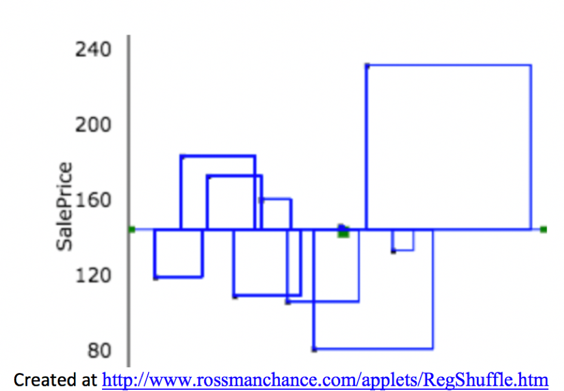
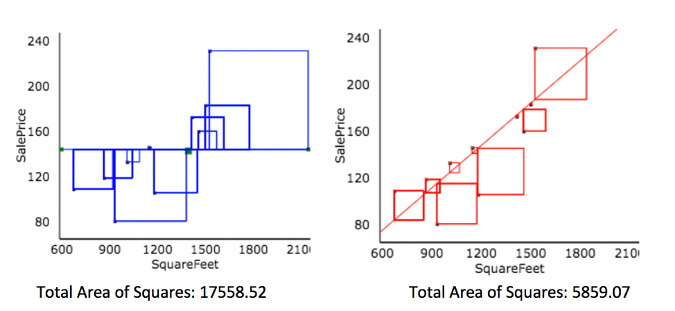
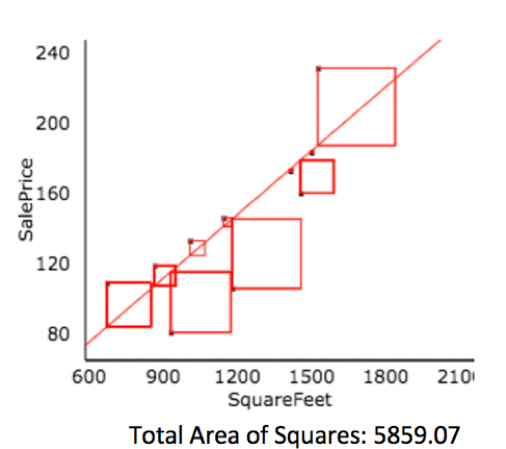

# Introduction to Statistical Models

**Learning Outcomes:**     

1. Calculate sums of squares related to variability explained, including SST, SSR, and SSM., when given small datasets and/or summary statistics.    
2. Explain the meaning of SST, SSR, and SSM in a given context.    
3. Calculate $R^2$ and ANOVA F-Statistics, when given small datasets and/or summary statistics.     
4. Intrepret $R^2$ and F-statistics in context.    
5. Explain the process for estimating least-squares regression coefficients.     
6. Calculate predictions from linear regression models.    
7. Interpret regression coefficients for models involving quantitative and/or categorical variables in context, or explain why it is inappropriate to do so.    
8. Explain the meaning of interaction between quantitative and categorical explanatory variables.   
9. Apply graphical methods, statistical summaries, and background knowledge to argue for whether or not interaction term(s) should be used in a statistical model.   
10. Determine slopes, intercepts, and other regression coefficients for specific categories or values of an explanatory variable in models that involve interaction.  


```{r, include=FALSE}
knitr::opts_chunk$set(echo = TRUE, message=FALSE, warning=FALSE, fig.height = 3, fig.width = 7, cache=FALSE)
library(ggformula)
library(moderndive)
library(gridExtra)
library(skimr)
library(Bolstad)
library(GGally)
library(Lock5Data)
library(knitr)
library(caret)
library(MASS)
library(tidyverse)
select <- dplyr::select
options(scipen=999)
set.seed(07302020)
```

## Predicting House Prices

### House Prices in Ames IA

```{r, echo=FALSE}
library(AmesHousing)
data(ames_raw)
Houses <- ames_raw %>% select(`Gr Liv Area`, Neighborhood, SalePrice)
Houses$Neighborhood <- as.factor(Houses$Neighborhood)
Houses <- Houses %>% filter(Neighborhood %in% c("NAmes", "CollgCr", "Edwards"))
Houses <- Houses %>% select(Neighborhood, `Gr Liv Area`, SalePrice)
Houses <- Houses %>% rename(SquareFeet = `Gr Liv Area`)
Houses <- Houses %>% mutate(SalePrice = SalePrice/1000)
Houses <- Houses[c(309,832,303,212,875,681,68,150,835, 735),]
Houses <- Houses %>% arrange(Neighborhood)
```

Shown below are the prices of 10 houses sold in Ames, IA between 2006 and 2010. 

```{r}
Houses$SalePrice
```

```{r, fig.height=4.5, fig.width=12}
ggplot(data=Houses, aes(x=SalePrice)) + geom_histogram(binwidth=60, fill="blue", color="white") + xlab("Price in thousands") + ylab("Frequency")+ theme_bw() + ggtitle("House Prices in Ames, IA")
```

```{r}
summary(Houses$SalePrice)
```


**Question:** Suppose we know that a particular house sold in Ames during this time period, but know nothing else about the house. Based on this estimation, how might we predict the price of the house? How confident are you in this prediction?   

### Prices by Neighborhood


* Now, suppose that the houses are in one of three neighborhoods (College Creek, Edwards, North Ames). Prices of the houses in each neighborhood are shown below.   

```{r, fig.height=4.5, fig.width=12}
p_House_Nbhd <- ggplot(data=Houses, aes(x=Neighborhood, y=SalePrice)) +geom_point()  + theme_bw() + ggtitle("Houses by Neighborhood")
p_House_Nbhd
```


```{r}
kable(Houses %>% select(Neighborhood, SalePrice))
```


**Question:** Suppose we know that a house sold in the College Creek neighborhood. How might we predict the price of the house? How confident are you in this prediction?    


### House Prices by Size

The scatterplot shows the relationship between the size of a house in square feet, and its saleprice. 

```{r, fig.height=3, fig.width=6}
ggplot(data=Houses, aes(x=SquareFeet, y=SalePrice)) + geom_point() 
```

**Question:** Suppose we know that another house, not in the original data, had 1200 square feet. How might we predict the saleprice of the house? How confident are you in this prediction?   


### Explanatory and Response Variables

Now, suppose we want to use information about the house's neighborhood in our predictions. 

We'll predict a price of a house to be the average price among houses in the neightborhood.   

* The variable we are trying to predict (price) is called the **response variable** (denoted $Y$).    


* The variable(s) we use to help us make the prediction (neighborhood) is(are) called **explanatory variables** (denoted $X$). These are also referred to as **predictor variables** or **covariates**.    

### Prediction with No Explanatory Variables

If we have the prices of $n$ houses, $y_i, y_2, \ldots, y_n$, and want to predict the price of a new house, without information about any explanatory variables the ``statistically optimal" prediction is the overall average price of all houses in the dataset.  

\[
\widehat{\text{Price}} = \bar{y},  \text{where } \bar{y}=\frac{\displaystyle\sum_{i=1}^ny_i}{n}\]. 

* The symbol $\widehat{\text{Price}}$, represents the predicted, or expected, price.  

```{r, fig.height=4.5, fig.width=12}
ggplot(data=Houses, aes(x=1, y=SalePrice)) + geom_point() + ylab("Price in thousands") + 
  xlab("")+ theme(axis.text.x = element_blank()) + 
  stat_summary(fun = mean, geom = "errorbar", aes(ymax = ..y.., ymin = ..y..), color="red") + 
  annotate("text", y=145, x=1.25, label="sample mean", color="red") + theme_bw() + ggtitle("All 10 Houses")
```

```{r}
mean(Houses$SalePrice)
```


Without information about any explanatory variables, we would predict the price of a house sold in Ames, IA during this time to be about 148 thousand dollars. 


### Simple Model in R

```{r}
M0 <- lm(data=Houses, SalePrice~1)
summary(M0)
```
Without information about any explanatory variables, we would predict the price of a house sold in Ames, IA during this time to be about 148 thousand dollars. 


### Prediction for a Categorical Explanatory Variable

When we have a categorical explanatory variable (e.g. neighborhood), the "statistically optimal" prediction is the average response among all observations in the given category.  

```{r, fig.height=4.5, fig.width=12}
p_House_Nbhd
```


```{r}
NbhdTbl <- Houses %>% group_by(Neighborhood) %>% 
  summarize(AveragePrice=mean(SalePrice))
kable(NbhdTbl)
```

We predict the price of a house in College Creek to be 195.33 thousand dollars, compared with 102.63 thousand dollars in Edwards, and 146.62 thousand dollars in Edwards.  


### Model by Neighborhood in R

```{r}
M_Nbhd <- lm(data=Houses, SalePrice ~ Neighborhood)
summary(M_Nbhd)
```

* For categorical explanatory variables, R treats the category that comes first alphabetically (in this case CCreek), as a baseline. The intercept gives the prediction for this category.   
    - We would expect a house in College Creek to cost 195.33 thousand dollars.

* Each of the other rows in the coefficients table represent the difference between the expected response (price) for that category (neighborhood), compared to the baseline.     
     - We would expect a house in Edwards to cost 92.70 thousand less than a house in College Creek. (hence costing 102.63 thousand)     
     - We would expect a house in North Ames to cost 48.71 thousand less than a house in College Creek. (hence costing 146.62 thousand)   

### Model Notation for Houses by Neighborhood     
    
The model can be expressed in the form:

```{r, include=FALSE}
b0 <- round(coef(M_Nbhd)[1],2)
b1 <- round(coef(M_Nbhd)[2],2)
b2 <- round(coef(M_Nbhd)[3],2)
```
$\widehat{\text{Price}}= b_0+  b_1 \times\text{I}_{\text{Edwards}} +b_2 \times\text{I}_{\text{NAmes}}$

$\widehat{\text{Price}}= `r b0`+  `r b1` \times\text{I}_{\text{Edwards}} +`r b2` \times\text{I}_{\text{NAmes}}$, where 

\text{I} represents an indicator variables, taking on values 0 or 1.     
    - Example: \[ \text{I}_{\text{Edwards}} =\begin{cases} 
      1 & \text{if house is in Edwards Neighborhood} \\
      0 & \text{otherwise}
       \end{cases}
      \]


**Predicted Prices:**

College Creek:  $\widehat{\text{Price}}= `r b0`+  `r b1` \times0 +`r b2` \times0 = 195.33$ thousand. 


Edwards:  $\widehat{\text{Price}}= `r b0`+  `r b1` \times1 +`r b2` \times0 = 102.63$ thousand.    

North Ames: $\widehat{\text{Price}}= `r b0`+  `r b1` \times0 +`r b2` \times1 = 146.62$ thousand.

### Prediction for Quantitative Explanatory Variable

For a quantitative explanatory variable like square feet, the "statistically optimal" prediction is found by fitting a "line of best fit" to the data (more details to come.)  

```{r, fig.height=3, fig.width=6}
ggplot(data=Houses, aes(x=SquareFeet, y=SalePrice)) + geom_point() + 
  stat_smooth(method="lm", se=FALSE)
```

* For a house with 1200 square feet, predicted price is about $150 thousand.    
    

### Model using Square Feet

```{r}
M_SqFt <- lm(data=Houses, SalePrice~SquareFeet) 
summary(M_SqFt)
```

### Model for SquareFeet and Interpretations

In the model using both square feet and neighborhood, the regression equation is

```{r, include=FALSE}
b0 <- round(coef(M_SqFt)[1],3)
b1 <- round(coef(M_SqFt)[2],3)
```
$\widehat{\text{Price}}= b_0+ b_1 \times\text{SquareFeet}$

$\widehat{\text{Price}}= `r b0`+ `r b1` \times\text{SquareFeet}$

* $\widehat{\text{Price}}$ represents the expected, or predicted, price.  

* The slope, $b_1$ represents the expected change in price (in thousands) per one-unit increase in square feet.   
     - The price of a house is expected to increase by `r b1*1000` dollars for each additional square foot.     
     
* The intercept, $b_0$ represents the expected price of a house with 0 square feet.      
      - In this situation, this is not a meaningful interpretation.       

### Calculating Predicted Prices 

$\widehat{\text{Price}}= `r b0`+ `r b1` \times\text{SquareFeet}$

* Predicted price for a house with 1200 square feet:     

$\widehat{\text{Price}}= `r b0`+ `r b1` \times 1200 = 151.8$ thousand dollars. 


## Variability Explained by a Model

### Quantifying Variability

We've seen the "statistically optimal" way to make predictions for data with categorical and quantitative explanatory variables, but we shouldn't expect these predictions to be exact. We see that prices of individual houses vary from one another, even if they are in the same neighborhood or have the same size.  

We can get a sense of how much variability we should expect in our prediction by looking at how much the values in our dataset differ from the predicted (mean) price.   

* The difference between the true and predicted values ($y_i - \hat{y}_i$) is called the $ith$ **residual**.   


### Residuals for Three Models

**Model with No Explanatory Variables**

```{r, fig.height=3, fig.width=8}
M0Resid <-ggplot(data=Houses, aes(x = 1:10, y = SalePrice)) +geom_point() + 
  geom_segment(aes(xend = 1:10, yend = M0$fitted.values), color="red") + 
  geom_abline(slope=0, intercept=mean(M0$fitted.values)) + xlab("")  + theme_bw() + theme(axis.text.x = element_blank())
M0Resid
```
**Model with Neighborhood as Explanatory Variable**

```{r, out.width = '80%', echo=FALSE}
knitr::include_graphics("Cat_Resid.png")
```

**Model with Square Feet as Explanatory Variable**

```{r,  fig.height=3.5, fig.width=8}
ggplot(data=Houses, aes(x = SquareFeet, y = SalePrice)) +
  geom_segment(aes(xend = SquareFeet, yend = M_SqFt$fitted.values), color="red") +
  geom_point() +
  geom_point(aes(y = M_SqFt$fitted.values), shape = 1) +
  stat_smooth(method="lm", se=FALSE)+
  theme_bw()
```

### Quantifying Unexplained Variablility

The residuals tell us how much variability in the response variable (sale price) is left unexplained by a model.   

For a model with given explanatory variable(s), we can calculate the proportion of variability in the response variable explained by the model by comparing the size of the residuals to those of a model with no explanatory variables.  
* $\displaystyle\sum_{i=1}^n (y_i - \hat{y})=0$, so this is not a helpful measure, but we can instead use: 

\[
\displaystyle\sum_{i=1}^n (y_i - \hat{y}_i)^2
\]


### Total Sum of Squares (SST)

We call the sum of squared residuals for the model with no explanatory variables the total sum of squares, abbreviated SST. In this model, $\hat{y}_i = \bar{y}$.   

\[SST = \displaystyle\sum_{i=1}^n (y_i - \bar{y})^2
\]


```{r}
SalePrice <- Houses$SalePrice
Predicted <- M0$fitted.values
SquareFeet <- Houses$SquareFeet
Residual <- M0$residuals  
ResidSq <- Residual^2
Residdf <- data.frame(SquareFeet, SalePrice, Predicted, Residual, ResidSq)
Residdf
```

```{r}
sum(Houses$SalePrice - mean(Houses$SalePrice))
```

```{r}
sum((Houses$SalePrice - mean(Houses$SalePrice))^2)
```


```{r,  out.width= '80%' }

```

SST represents the total amount of variability in sale price (without accounting for any explanatory variables). 

### SSR and SSM

When we fit a model with an explanatory variable (such as neighborhood), we can see how much the sum of squared residuals decreases, based on information introduced by that explanatory variable. 

```{r}
SalePrice <- Houses$SalePrice
Predicted <- M_Nbhd$fitted.values
Residual <- M_Nbhd$residuals   
ResidSq <- Residual^2
Neighborhood <- Houses$Neighborhood
Residdf <- data.frame(Neighborhood, SalePrice, Predicted, Residual, ResidSq)
Residdf
```

```{r}
sum(M_Nbhd$residuals^2)
```


* the variability in sale price remaining unexplained even after accounting for neighborhood is given by the sum of squared residuals. We abbreviate this SSR, for sum of squared residuals.    

\[
\text{SSR} = \text{Variability Remaining}=\displaystyle\sum_{i=1}^n(y_i-\hat{y}_i)^2
\]

* the difference, $\text{SST} - \text{SSR} = 17558.52 - 4656.188 = 12902.33$ tells us how much variability in sale price is explained by the model using neighborhood as an explanatory variable. We call this quantity the **sum of squares explained by the model**, abbreviated SSM. 

* The proportion of variability in sale price explained by the model using neighborhoods as an explanatory variable is 

\[\frac{SSM}{SST}=\frac{12902.33}{17558.52} = 0.7348
\]


* 73.5% of the variation in house price is explained by the model using neighborhood as an explanatory variable.  


```{r, echo=FALSE}
slices <- c(12901.81, 4656.188)
lbls <- c("SSM", "SSR")
lbls <- paste(lbls, slices) ## add percents to labels
pie(slices,labels = lbls, col=rainbow(length(lbls)),
   main="Total Variability in House Prices (SST)", radius=1)
```

The proportion of variability in the response variable explained by a model with given explanatory variables is called **the coefficient of determination**, and is given the symbol $R^2$. 

* Our value matches the value of "Multiple R-squared" in the 2nd last line of the R model summary. 

```{r}
summary(M_Nbhd)
```


### Summary: SST, SSR, SSM, $R^2$

* the total variability in house prices is the sum of the squared differences between price and average price.   

\[\text{Total Variability in Price}= \text{SST} =\displaystyle\sum_{i=1}^n(y_i-\bar{y})^2\]

* the variability remaining unexplained even after accounting for neighborhood is given by the sum of squared residuals. We abbreviate this SSR, for sum of squared residuals.    

\[
\text{SSR} = \text{Variability Remaining}=\displaystyle\sum_{i=1}^n(y_i-\hat{y}_i)^2
\]

* the variability explained by the model, abbreviated SSM, is given by 

\[ \text{SSM} = \text{SST} - \text{SSR} \]

It can be shown that $\text{SSM}=\displaystyle\sum_{i=1}^n(\hat{y}_i-\bar{y})^2$. These abbreviations here vary across texts. Be careful!

* The coefficient of determination (abbreviated $R^2$) is defined as    

\[R^2=\frac{\text{Variability Explained by Model}}{\text{Total Variability}}=\frac{\text{SSM}}{\text{SST}} =\frac{\displaystyle\sum_{i=1}^n(\hat{y}_i-\bar{y})^2}{\displaystyle\sum_{i=1}^n(y_i-\bar{y})^2}\]


### $R^2$ Visually

```{r, echo=FALSE, out.width = '100%'}
knitr::include_graphics("Rsq2.png")
```

* Blue Area = Total Variability (SST)    

* Red Area = Variability Remaining Unexplained by Model (SSR)   

* Blue Area - Red Area = Variability Explained by Model (SSM)     

* $R^2 = \frac{\text{Area of Blue Squares} - \text{Area of Red Squares}}{\text{Area of Blue Squares}} = \frac{\text{SST}-\text{SSR}}{\text{SST}}= \frac{\text{SSM}}{\text{SST}}$


### Residuals for Square Feet Model


```{r, fig.height=3.5, fig.width=8}
ggplot(data=Houses, aes(x = SquareFeet, y = SalePrice)) +
  geom_segment(aes(xend = SquareFeet, yend = M_SqFt$fitted.values), color="red") +
  geom_point() +
  geom_point(aes(y = M_SqFt$fitted.values), shape = 1) +
  stat_smooth(method="lm", se=FALSE)+
  theme_bw()
```


```{r}
SalePrice <- Houses$SalePrice
Predicted <- M_SqFt$fitted.values
Residual <- M_SqFt$residuals   
ResidSq <- Residual^2
SquareFeet <- Houses$SquareFeet
Residdf <- data.frame(SquareFeet, SalePrice, Predicted, Residual, ResidSq)
Residdf
```


```{r}
sum(M_SqFt$residuals^2)
```


### Variation Explained by SquareFeet Model

```{r, echo=FALSE, out.width = '100%'}

```

Created at http://www.rossmanchance.com/applets/RegShuffle.htm.  


* Blue Area = Total Variability (SST)    

* Red Area = Variability Remaining Unexplained by Model (SSR)   

* Blue Area - Red Area = Variability Explained by Model (SSM)     

* $R^2 = \frac{\text{Area of Blue Squares} - \text{Area of Red Squares}}{\text{Area of Blue Squares}} = \frac{\text{SST}-\text{SSR}}{\text{SST}}= \frac{\text{SSM}}{\text{SST}}$


### Variation Explained by Square Feet Model 


* Total variability in house prices SST = 17,558.52    
* Variability remaining unexplained after accounting for square feet is SSR = 5,859.07     
* Variation explained by model accounting for square feet is \[ \text{SSM} = 17,558.52 - 5,859.07 = 11,699.45 \]
* Proportion of variation explained by model accounting for square feet is \[ R^2=\frac{11,699.45}{17,558.52}\approx0.6663\]

* 66.6% of the variation in house price is explained by the model using square feet as an explanatory variable.  


```{r, echo=FALSE}
slices <- c(11699.45, 5859.07)
lbls <- c("SSM", "SSR")
lbls <- paste(lbls, slices) ## add percents to labels
pie(slices,labels = lbls, col=rainbow(length(lbls)),
   main="Total Variability in House Prices (SST)", radius=1)
```


```{r}
summary(M_SqFt)
```

### Linear Correlation Coefficient

```{r, fig.height=3, fig.width=6}
ggplot(data=Houses, aes(x=SquareFeet, y=SalePrice)) + geom_point() + 
  stat_smooth(method="lm", se=FALSE)
```

* For linear models with a single quantitative variable, the **linear correlation coefficient** $r=\sqrt{R^2}$, or $r=-\sqrt{R^2}$ (with sign matching the sign on the slope of the line), provides information about the strength and direction of the linear relationship between the variables. 

* $-1 \leq r \leq 1$, and $r$ close to $\pm1$ provides evidence of strong linear relationship, while $r$ close to 0 suggests linear relationship is weak.    

* $r$ is only relevant for models with a single quantitative explanatory variable and a quantitative response variable, while $R^2$ is relevant for any linear model with a quantitative response variable.  

```{r}
cor(Houses$SalePrice,Houses$SquareFeet)
```


## Multiple Regression Model

### Multiple Regression Model

Suppose we have information on both the neighborhood and square feet in the houses. We can account for both of these together using a **multiple regression model**, i.e. a model with more than one explanatory variable. 

```{r}
kable(Houses)
```

How can we predict the price of a:  

* 848 square foot house in College Creek?   
* 1200 square foot house in North Ames?    
* 2314 square foot house in Edwards?    


### 2-Variable Model Different Slopes

We could try to lines to the houses in each neighborhood, independent of the other neighborhoods. 

```{r}
ggplot(data=Houses, aes(x=SquareFeet, y=SalePrice, color=Neighborhood)) + geom_point() + stat_smooth(method="lm", se=FALSE) 
```

Since there are only 3-4 houses per neighbhorhood, though, this isn't a lot of information to go on.  


### 2-Variable Model with Constant Slope  


Instead, we'll assume the rate of increase wrt. square feet (i.e. slope) is the same in each neighborhood, but that some neighborhoods are more expensive than others. 

This allows us to use all 10 houses to estimate slope, while allowing intercepts to differ between neighborhoods.  

```{r, echo=FALSE}
M_Nbhd_SqFt <- lm(data=Houses, SalePrice~SquareFeet + Neighborhood)
equation1 <- function(x){coef(M_Nbhd_SqFt)[2]*x+coef(M_Nbhd_SqFt)[1]}
equation2  <- function(x){coef(M_Nbhd_SqFt)[2]*x+coef(M_Nbhd_SqFt)[1]+coef(M_Nbhd_SqFt)[3]}
equation3  <- function(x){coef(M_Nbhd_SqFt)[2]*x+coef(M_Nbhd_SqFt)[1]+coef(M_Nbhd_SqFt)[4]}
```

```{r, echo=FALSE, fig.height=4, fig.width=8}
PM3 <- ggplot(data=Houses, aes(x=SquareFeet, y=SalePrice, color=Neighborhood)) + geom_point()+
        stat_function(fun=equation1,geom="line",color=scales::hue_pal()(3)[1]) +
        stat_function(fun=equation2,geom="line",color=scales::hue_pal()(3)[2]) +  
        stat_function(fun=equation3,geom="line",color=scales::hue_pal()(3)[3])   
PM3
```

### House Price 2-Variable Model Summary 

```{r}
M_Nbhd_SqFt <- lm(data=Houses, SalePrice~SquareFeet+Neighborhood)
summary(M_Nbhd_SqFt)
```

### MR Model for SquareFeet and Neighborhood

In the model using both square feet and neighborhood, the regression equation is

```{r, include=FALSE}
b0 <- round(coef(M_Nbhd_SqFt)[1],2)
b1 <- round(coef(M_Nbhd_SqFt)[2],2)
b2 <- round(coef(M_Nbhd_SqFt)[3],2)
b3 <- round(coef(M_Nbhd_SqFt)[4],2)
```

$\widehat{\text{Price}}= b_0+ b_1 \times\text{SquareFeet}+ b_2\times\text{I}_{Edwards} + b_3 \times\text{I}_{NAmes}$

$\widehat{\text{Price}}= `r b0`+ `r b1` \times\text{SquareFeet}+ `r b2` \times\text{I}_{Edwards} +`r b3` \times\text{I}_{NAmes}$

* The intercept $b_0$ represents the expected price of a house in College Creek with 0 square feet.    
     - the intercept has no meaningful interpretation in this context
* $b_1$ represents the expected change in price (in thousands) per one-unit increase in square feet, assuming neighborhood is the same.    
     - on average, we expect the price of a house to increase by $0.05933 thousand (i.e. $59.33) for each additional square foot, assuming the houses are in the same neighborhood.    
* $b_2$ and $b_3$ represent the expected difference in price between a house in the Edwards (or North Ames) neighborhood, compared to the College Creek neighborhood, assuming square footage is the same.       
    - We expect a house in the Edwards neighborhood to cost $59.094 less than a house in the College Creek Neighborhood, assuming the houses are the same size.    
    - We expect a house in the North Ames Neighborhood to cost $25.812 less than a house in the College Creek Neighborhood, assuming the houses are the same size.   
    
    
### Predicting Price in MR Model 

$\widehat{\text{Price}}= `r b0`+ `r b1` \times\text{SquareFeet}+ `r b2` \times\text{I}_{Edwards} +`r b3` \times\text{I}_{NAmes}$

* 848 square foot house in College Creek

$\widehat{\text{Price}}= `r b0`+ `r b1` \times848+ `r b2` \times0 +`r b3` \times 0 =157.0378$ thousand

* 1200 square foot house in North Ames   

$\widehat{\text{Price}}= `r b0`+ `r b1` \times1200+ `r b2` \times0 +`r b3` \times1 = 152.1096$ thousand


* 2314 square foot house in Edwards

$\widehat{\text{Price}}= `r b0`+ `r b1` \times\text{SquareFeet}+ `r b2` \times1 +`r b3` \times 0 =184.9212$ thousand


### Risk of Extrapolation

Note that 2314 square feet is well outside the range of our observed data. We should treat this prediction with caution, since we don't know whether the trend we see in our data will continue.  


```{r, echo=FALSE, fig.width=8, fig.height=5}
PM3
```


### Residuals for 2-Variable Model

```{r, echo=FALSE, fig.height=5, fig.width=8}
ggplot(data=Houses, aes(x=SquareFeet, y=SalePrice, color=Neighborhood)) + geom_point()+
        stat_function(fun=equation1,geom="line",color=scales::hue_pal()(3)[1]) +
        stat_function(fun=equation2,geom="line",color=scales::hue_pal()(3)[2]) +  
        stat_function(fun=equation3,geom="line",color=scales::hue_pal()(3)[3]) +   
geom_segment(aes(xend = SquareFeet, yend = M_Nbhd_SqFt$fitted.values), color="red") 

```

### Residuals for 2-Variable Model  (cont.)

```{r}
SalePrice <- Houses$SalePrice
Predicted <- M_Nbhd_SqFt$fitted.values
Residual <- M_Nbhd_SqFt$residuals   
ResidSq <- M_Nbhd_SqFt$residuals^2
Residdf <- data.frame(SalePrice, Predicted, Residual, ResidSq)
Residdf
```

```{r}
sum(M_Nbhd_SqFt$residuals^2)
```


### Variation Explained by 2-Variable Model   


* Total Variation in house prices: SST=17,558.52    
* Variation remaining unexplained after accounting for square feet is SSR=3,616.139     
* Variation explained by model accounting for square feet is 
\[SSM=SST-SSR=17,558.52 - 3,616.139 = 13,942.38\]

* Proportion of variation in house prices explained by model is:

\[ R^2 = \frac{13,942.38}{17,558.52}\approx0.794 \]

* 79.4% of the variation in house price is explained by the model using square feet and neighborhood as an explanatory variables.  

```{r, echo=FALSE}
slices <- c(13942.38, 3616.139)
lbls <- c("SSM", "SSR")
lbls <- paste(lbls, slices) ## add percents to labels
pie(slices,labels = lbls, col=rainbow(length(lbls)),
   main="Total Variability in House Prices (SST)", radius=1)
```


### Model Comparison Summary

```{r, include=FALSE}
options(scipen=999)
R0 <- sum(M0$residuals^2)
R1 <- sum(M_Nbhd$residuals^2)
R2 <- sum(M_SqFt$residuals^2)
R3 <- sum(M_Nbhd_SqFt$residuals^2)
```

| Model | Variables | Unexplained Variability | Variability Explained |  $R^2$ |    
|------ | ---------- | -----------| -----------|-----------|
| 0 | None |`r R0` | 0 | 0 | 
| 1 | Nbhd |`r R1` | `r R0-R1` | `r (R0-R1)/R0` |
| 2 | Sq. Ft. |`r R2` | `r R0-R2` | `r (R0-R2)/R0` | 
| 3 | Nbhd, Sq. Ft. |`r R3` | `r R0-R3` | `r (R0-R3)/R0` |


**Comments on $R^2$:**   

* $R^2$ will never decrease when a new variable is added to a model.      
* This does not mean that adding more variables to a model always improves its ability to make predictions on new data.     
* $R^2$ measures how well a model fits the data on which it was built.   
* It is possible for a model with high $R^2$ to "overfit" the data it was built from, and thus perform poorly on new data. We will discuss this idea extensively later in the course.   

* On some datasets, there is a lot of "natural" variability in the response variable, and no model will achieve a high $R^2$. That's okay. Even a model with $R^2 = 0.10$ or less can provide useful information.   

* The task of a statistician is not to achieve a model that makes perfect predictions, but rather to be able to quantify the amount of uncertainty associated with the predictions we make.   


## Least-Squares Estimation


### Line of Best Fit

```{r, fig.height=2, fig.width=6}
ggplot(data=Houses, aes(x=SquareFeet, y=SalePrice)) + geom_point() + 
  stat_smooth(method="lm", se=FALSE)
```

* The line $\text{Price} = 6.82 + 0.12 \times \text{Square Feet}$ is considered the "line of best fit" in the sense that it minimizes the sum of the squared residuals. 


```{r, echo=FALSE, out.width = '75%'}

```


* This [Rossman-Chance applet](http://www.rossmanchance.com/applets/RegShuffle.htm) provides an illustration of the line of best fit.   
   


### Least-Squares Estimation in Simple Linear Regression

* Consider a **simple linear regression(SLR)** model, which is one with a singe quantitative explanatory variable.

* $\hat{y}_i = b_0+b_1x_i$ 

* we need to choose the values of $b_0$ and $b_1$ that minimize:

\[
\displaystyle\sum_{i=1}^n(y_i-\hat{y}_i)^2 =\displaystyle\sum_{i=1}^n(y_i-(b_0+b_1x_i))^2
\]


### Least-Squares Estimation in Simple Linear Regression (cont.) 

Using calculus, it can be shown that this quantity is minimized when 

* $b_1=\frac{\displaystyle\sum_{i=1}^{n}(x_i-\bar{x})(y_i-\bar{y})}{\displaystyle\sum_{i=1}^{n}(x_i-\bar{x})^2}=\frac{\displaystyle\sum_{i=1}^{n} x_i y_i-\frac{\displaystyle\sum_{i=1}^{n} x_i \displaystyle\sum_{i=1}^{n} y_i }{n}}{\left(\displaystyle\sum_{i=1}^{n} x_i^2 -\frac{\left(\displaystyle\sum_{i=1}^{n} x_i\right)^2}{n}\right)}$ 

* $b_0=\bar{y}-b_1\bar{x}$ (where $\bar{y}=\frac{\displaystyle\sum_{i=1}^{n}{y_i}}{n}$, and $\bar{x}=\frac{\displaystyle\sum_{i=1}^{n}{x_i}}{n}$).   


### LS Estimation for One Categorical Variable

* Consider a model with a single categorical variable (such as neighborhood), with G+1 categories, numbered $g=0,2, \ldots, G$

* Then $\hat{y}_i = b_0 + b_1x_{i1} + \ldots +b_{G}x_{iG}$.    

* we need to minimize 

\[
\displaystyle\sum_{i=1}^n(y_i-\hat{y}_i)^2 =\displaystyle\sum_{i=1}^n(y_i-(b_0 + b_1x_{i1} + \ldots +b_{G}x_{iG}))^2.   
\]

* It can be shown that this is achieved when    
  - $b_0 = \bar{y_0}$ (i.e. the average response in the "baseline group"), and   
  - $b_j = \bar{y_j} - \bar{y}_0$   
  
  
### LS Estimation More Generally

* For multiple regression models, the logic is the same. We need to choose $b_0, b_1, \ldots, b_p$ in order to minimize

\[ \displaystyle\sum_{i=1}^n (y_i -\hat{y}_i)^2  = \displaystyle\sum_{i=1}^n (y_i -(b_0 + b_1x_{i1} + b_2x_{i2} + \ldots + b_px_{ip}))^2 \]

* The mathematics, however are more complicated and require inverting a matrix. This goes beyond the scope of this class, so we will let R do the estimation and use the results.   

* More on least squares estimation in multiple regression can be found [here](http://www.math.chalmers.se/Stat/Grundutb/GU/MSG500/A10/lecture5.pdf). 


## ANalysis Of VAriance


### Submodels

| Model | Variables | Unexplained Variability | Variability Explained |  $R^2$ |    
|------ | ---------- | -----------| -----------|-----------|
| 0 | None |`r R0` | 0 | 0 | 
| 1 | Nbhd. |`r R1` | `r R0-R1` | `r (R0-R1)/R0` | 
| 2 | Sq. Ft  |`r R2` | `r R0-R2` | `r (R0-R2)/R0` |
| 3 | Nbhd, Sq. Ft. |`r R3` | `r R0-R3` | `r (R0-R3)/R0` |


* Notice that Model 1 is a submodel of Model 3, since all variables used in Model 1 are also used in Model 3.   

* Model 2 is also a submodel of Model 3.    

* Model 0 is a submodel of Models 1, 2, and 3.   

* Models 1 and 2 are not submodels of each other, since Model 1 contains a variable used in Model 2 and Model 2 contains a variable not used in Model 1.   


### Comparing Submodels

When one model is a submodel of another, we can compare the amount of variability explained by the models, using a technique known as **ANalysis Of VAriance (ANOVA)**.   

Reduced Model: $\hat{y}_i = b_0 + b_1x_{i1} + b_2x_{i2} + \ldots + b_qx_{iq}$

Full Model:  $\hat{y}_i = b_0 + b_1x_{i1} + b_2x_{i2} + \ldots + b_qx_{iq} + b_{q+1}x_{i{q+1}} \ldots + b_px_{ip}$

p = # variables in Full Model   
q = # variables in Reduced Model  
n = number of observations

We calculate a statistic called F: 

$$
\begin{aligned}
F  
&= \frac{\frac{\text{SSR}_{\text{Reduced}}-\text{SSR}_{\text{Full}}}{p-q}}{\frac{\text{SSR}_{\text{Full}}}{n-(p+1)}}
\end{aligned}
$$

**Questions:** 
1. If the full model does a much better job explaining variability in the response variable than the reduced model, will the F-statistic be large or small?    

2. Can an F-statistic ever be negative? Why or why not?    


### Comments on F-Statistic

* The F-statistic measures the amount of variability explained by adding additional variable(s) to the model, relative to the total amount of unexplained variability.   

* Large values of F indicate that adding the additional explanatory variables is helpful in explaining variability in the response variable    
* Small values of F indicate that adding new explanatory variables variables does not make much of a difference in explaining variability in the response variable    
* What counts as "large" is depends on $n, p,$ and $q$. We will revisit this later in the course.   

### ANOVA F-Statistic 

Let's Calculate an ANOVA F-Statistic to compare Models 2 and 3.   

Reduced Model: $\widehat{\text{Price}}= b_0+ b_1 \times\text{SquareFeet}$      

Full Model: $\widehat{\text{Price}}= b_0+ b_1 \times\text{SquareFeet}+ b_2\times\text{I}_{Edwards} + b_3 \times\text{I}_{NAmes}$     


$$
\begin{aligned}
F &= \frac{\frac{\text{SSR}_{\text{Reduced}}-\text{SSR}_{\text{Full}}}{p-q}}{\frac{\text{SSR}_{\text{Full}}}{n-(p+1)}} \\
&=\frac{\frac{5,859.07-3,616.14}{3-1}}{\frac{3,616.13}{10-(3+1)}} \\
\end{aligned}
$$


```{r}
SSR2 <- sum(M_SqFt$residuals^2); SSR3 <- sum(M_Nbhd_SqFt$residuals^2);
((SSR2-SSR3)/(3-1))/((SSR3)/(10-(3+1)))
```

### ANOVA F-Statistic for M2 vs M3 in R

```{r}
anova(M_SqFt, M_Nbhd_SqFt)
```

Notice the F-statistic has the same value. 

Later, we will examine what this tells us about adding Neighborhood to a model already containing square feet as an explanatory variable.   


### ANOVA F-Statistic for M1 vs M0

Now, let's compare Models 0 and 1.  

Reduced Model: $\widehat{\text{Price}}_i = b_0$

Full Model:  $\widehat{\text{Price}}_i = b_0 + b_1\text{I}_{\text{Edwards}} + b_2\text{I}_{\text{NAmes}}$

$$
\begin{aligned}
F &= \frac{\frac{\text{SSR}_{\text{Reduced}}-\text{SSR}_{\text{Full}}}{p-q}}{\frac{\text{SSR}_{\text{Full}}}{n-(p+1)}} \\
&=\frac{\frac{17558.52-4656.19}{2-0}}{\frac{4656.19}{10-(2+1)}}
\end{aligned}
$$

```{r}
SSR0 <- sum(M0$residuals^2); SSR1 <- sum(M_Nbhd$residuals^2);
((SSR0-SSR1)/(2-0))/((SSR1)/(10-(2+1)))
```

### ANOVA F-Statistic for M0 vs M1 in R

```{r}
anova(M0, M_Nbhd)
```

### ANOVA F-Statistic for Categorical Variables

* The difference between M1 and M0 is that M1 considers the house's neighborhood, while M0 does not.   
* If neighborhood is helpful in modeling house price, then we would expect to see a high F-statistic.   
* Another way to think about this is that if the amount of variability in house prices between different neighborhoods is large, relative to the amount of variability within neighborhoods, then the F-statistic should be large.   
* In fact, an alternative (an mathematically equivalent) way to calculate the F-statistic is to calculate the ratio of variability between different neighborhoods, relative to the amount of variability within neighborhoods. 

### F-Statistic for Categorical Variables Illustration

An F-statistic compares the amount of variability between groups to the amount of variability within groups. 

```{r, echo=FALSE}
y <- c( 4,5,6,7,8, 13, 14, 15, 16, 17, 8,9,8,10,11)     
Group <- c(rep("A", 5), rep("B", 5), rep("C", 5))
df1 <- data.frame(y, Group)
y <- c( 3, 5, 9, 12, 16, 6, 8, 9, 12, 18, 13, 15, 2, 9, 6)
Group <- c(rep("A", 5), rep("B", 5), rep("C", 5))
df2 <- data.frame(y, Group)

p1 <- ggplot(data=df1, aes(y=y, x=Group))+ geom_point() + ggtitle("Scenario 1")
p2 <- ggplot(data=df2, aes(y=y, x=Group))+ geom_point() + ggtitle("Scenario 2")
```

```{r, fig.height=2.5, fig.width=9, echo=FALSE}
grid.arrange(p1, p2, ncol=2)
```


|             |  Scenario 1 | Scenario 2 |
|-----------|----------|-----------|
| variation between groups    |  High  |  Low |
| variation within groups   | Low  |  High |
| F Statistic |  Large       |   Small     |    
| Result |    Evidence of Group Differences      |   No evidence of differences |

**Question:** Suppose, in these scenarios, we perform an F-test comparing a model the includes group as an explanatory variable, to one the includes no explanatory variables? Which scenario (1 or 2) would you expect to result in a larger F-statistic?   


### Alternative F-Statistic Formula

For a categorical variable with $g$ groups, 

* let $\bar{y}_{1\cdot}, \ldots, \bar{y}_{g\cdot}$ represent the mean response for each group.   

* let $n_1, \ldots, n_g$ represent the sample size for each group   

* Then $\frac{\displaystyle\sum_{i=1}^g\sum_{j=1}^{n_i}n_i(y_{i\cdot}-\bar{y}_{\cdot\cdot})^2}{g-1}$ gives a measure of how much the group means differ, and 

* $\frac{\displaystyle\sum_{i=1}^g\sum_{j=1}^{n_i}(y_{ij}-\bar{y}_{i\cdot})^2}{n-g}$ gives a measure of how much individual observations differ within groups     


* An alternative formula for this F-statistic is:

\[
F= \frac{\text{Variability between Neighborhoods}}{\text{Variability within Neighborhoods}}= \frac{\frac{\displaystyle\sum_{i=1}^g\sum_{j=1}^{n_i}n_i(y_{i\cdot}-\bar{y}_{\cdot\cdot})^2}{g-1}}{\frac{\displaystyle\sum_{i=1}^g\sum_{j=1}^{n_i}(y_{ij}-\bar{y}_{i\cdot})^2}{n-g}}
\]    

* It can be shown that this statistic is equivalent to the one we saw previously.   

### Calculating F-Statistic for Categorical Variables

We have seen previously that:   

* $\bar{y}_{\cdot\cdot}=148.039$   (overall average price), and $n=10$
* $\bar{y}_{1\cdot}=195.330$  (average price in College Creek), and $n_1=3$     
* $\bar{y}_{2\cdot}=102.633$  (average price in Edwards), and $n_2=4$   
* $\bar{y}_{3\cdot}=146.625$  (average price in North Ames), and $n_3=3$     

Then, 

* $\frac{\displaystyle\sum_{i=1}^g\sum_{j=1}^{n_i}(y_{i\cdot}-\bar{y}_{\cdot\cdot})^2}{g-1} = \frac{3(195.330-148.039)^2+3(102.633-148.039)^2+4(146.625-148.039)^2}{3-1} = \frac{12902}{2}$, and 

* $\frac{\displaystyle\sum_{i=1}^g\sum_{j=1}^{n_i}(y_{ij}-\bar{y}_{i\cdot})^2}{n-g} = \frac{(123.00-146.625)^2+ (187.00 - 195.33)^2 + \ldots + (137.00-146.625)^2}{10-3} = \frac{4656}{7}$

### Calculating F-Statistic for Categorical Variables {.cont}

\[
F= \frac{\frac{\displaystyle\sum_{i=1}^g\sum_{j=1}^{n_i}n_i(y_{i\cdot}-\bar{y}_{\cdot\cdot})^2}{g-1}}{\frac{\displaystyle\sum_{i=1}^g\sum_{j=1}^{n_i}(y_{ij}-\bar{y}_{i\cdot})^2}{n-g}} = \frac{\frac{(195.330-148.039)^2+(102.633-148.039)^2+(146.625-148.039)^2}{3-1}}{\frac{(123.00-146.625)^2+ (187.00 - 195.33)^2 + \ldots + (137.00-146.625)^2}{10-3}} = \frac{\frac{12902}{2}}{\frac{4656}{7}}
\] 

* Note that the quantity in the the quantity in the third line is equivalent to the sum of the squared residuals using M2. Thus, we can calculate F using:

```{r}
((3*(195.330-148.039)^2+3*(102.633-148.039)^2+4*(146.625-148.039)^2)/(3-1))/(sum(M_Nbhd$residuals^2)/(10-3))
```

### Alternative Calculation in R

This interpretation of the F-statistic can be seen using the AOV command in R.

```{r}
AOV_Nbhd <- aov(data=Houses, SalePrice~Neighborhood)
summary(AOV_Nbhd)
```

* The *Neighborhood* line represents the variability between neighborhoods    
* The *Residuals* line represents the variability within neighborhoods   

* The first two columns give the quantities we use in our formula. The third column, representing the ratio of the first two columns is called a **mean square.**

### F-Statistic in R Output

The last line in the summary output includes the F-statistic for the specified model, compared to a reduced model that includes only the intercept. 

Reduced Model: $\widehat{Y}= b_0$      

Full Model: $\widehat{Y}= b_0+ b_1 X_{i1}+ \ldots+ b_p X_{ip}$      

This statistic addresses the question *"Do any of the explanatory variables help explain variability in Y?"*.   

When there is only one explanatory variable in the model, this statistic can be used to test whether there is evidence that this statistic is associated with $Y$.    

### F-Statistic in R Output M1

The F-statistic compares a full model that includes neighborhood to a reduced model that predicts each price using the overall average.  
```{r}
summary(M_Nbhd)
```

### F-Statistic in R Output M2

The F-statistic compares a full model that includes square feet to a reduced model that predicts each price using the overall average.  
```{r}
summary(M_SqFt)
```


### F-Statistic in R Output M3

The F-statistic compares a full model that includes square feet and neighborhood to a reduced model that predicts each price using only the overall average. 

```{r}
summary(M_Nbhd_SqFt)
```


### When to Use F-Statistics for Model Comparison    

* We have used F-statistics to compare models 1 and 3, and models 0 and 2. 
* We could also calculate F-statistics comparing models 2 and 3, models 0 and 1, and models 0 and 3.    
* We cannot use an F-statistic to compare models 1 and 2, since neither is a submodel of the other.   
* When comparing a model to the "intercept-only" model, we can use the model summary output. When comparing other to other submodels, use the `aov()` or `anova()` commands. 


## Models Involving Interaction

### Bear Weights Dataset

The `Bolstad` R package provides data on body measurements for a sample of 143 wild bears, who were anesthetized, measured and weighed, then released.  Variables include:   

`ID.`- Indentification number

`Age` - Bear's age, in months. Note, wild bears are always born in January, so an expert can estimate the bear's age without directly asking it how old it is.

`Month`- Month when the measurement was made. 1 = Jan., 12 = Dec. Since bears hibernate in the winter, their body shape probably depends on the season.

`Sex` - 1 = male 2 = female

`Head.L` - Length of the head, in inches

`Head.W.` - Width of the head, in inches

`Neck.G.` - Girth (distance around) the neck, in inches

`Length.` - Body length, in inches

`Chest.G.` - Girth (distance around) the chest, in inches

`Weight` - Weight of the bear, in pounds

`Obs.No` - Observation number for this bear. For example, the bear with ID = 41 (Bertha) was measured on four occasions, in the months coded 7, 8, 11, and 5. The value of Obs.No goes from 1 to 4 for these observations.

`Name` - The names of the bears given to them by the researchers


**Question of Interest:** How quickly do bears gain weight as they grow? Do male and female bears gain weight at the same rate?   

### Exploring Bears Data

```{r}
library(Bolstad)
data(bears)
glimpse(bears)
```

```{r}
head(bears)
```


### Bears Data Cleaning

Notice that we have multiple observations on the same bears. The procedures we have learned so far require observations to be independent of each other. Thus, we'll keep only the first observation on each bear.  

```{r}
Bears_Subset <- bears %>% filter(Obs.No == 1)
```

The variables Month and Sex are coded as integers, but it really makes more sense to think of these as categorical variables. Thus, we will convert them to factors. 

```{r}
Bears_Subset$Month <- as.factor(Bears_Subset$Month)
Bears_Subset$Sex <- as.factor(Bears_Subset$Sex)
```

```{r}
summary(Bears_Subset)
```

### Bear Weights and Ages

**Histogram of Bear Weights**

```{r}
ggplot(data=Bears_Subset, aes(x=Weight)) + 
  geom_histogram(color="white", fill="lightblue") + 
  xlab("Weight") + ylab("Frequency") + ggtitle("Weights of Bears")
```

We see that bears most commonly weigh between 100 and 200 lbs, and the distribution of weights is right-skewed.  

**Histogram of Bear Ages**

```{r}
ggplot(data=Bears_Subset, aes(x=Age)) + 
  geom_histogram(color="white", fill="lightblue") + 
  xlab("Age (in months)") + ylab("Frequency") + ggtitle("Ages of Bears (in months)")
```

Most of the bears are less than 72 months (6 years) old, although there are a few older bears. 


**Bears with Missing Ages**

Recall that 41 bears had missing ages. They will be ignored if we use age in our model. To see how this might impact predicted weights, let's look at how weights compare for bears with and without missing ages.  

```{r}
ggplot(data=Bears_Subset, aes(x=is.na(Age), y=Weight)) + geom_boxplot() + coord_flip()
```

Bears with missing ages do not seem to be systematically different than those whose ages are recorded, with respect to weight, so the missing ages should not cause too much concern with out model results. 

**Boxplot of Weight by Sex**

```{r}
ggplot(data=Bears_Subset, aes(y=Weight, x=Sex)) + 
  geom_boxplot() + 
  xlab("Sex(1=M, 2=F)") + ylab("Weight in lbs") + ggtitle("Weight by Sex") + coord_flip()
```


**Boxplot of Age by Sex**

```{r}
ggplot(data=Bears_Subset, aes(y=Age, x=Sex)) + 
  geom_boxplot() + 
  xlab("Sex(1=M, 2=F)") + ylab("Age in Months") + ggtitle("Age by Sex") + coord_flip()
```

The median age for female bears is older than for male bears. There are 2 male bears that are much older than any others. 


**Scatterplot of Age and Weight**

```{r,  fig.height=4, fig.width=8}
ggplot(data=Bears_Subset, aes(x=Age, y=Weight, color=Sex)) + geom_point() + xlab("Age in Months")
```

We see that there is a positive, roughly linear, relationship between age and weight. 

We should note that this linear trend is not likely to continue outside the range of our observed ages.   


### Two Possible Models

We'll consider two possible models, based on different sets of assumptions.  

**Model 1 Assumptions:**   
* Assume weight increases linearly with age     
* Allow for differences in expected weight for male and female bears of same age    
* Assume male and female bears gain weight at the same rate as they age     

**Model 2 Assumptions**     
* Assumes weight increases linearly with age     
* Allows for differences in expected weight for male and female bears of same age    
* Allows male and female bears to gain weight at different rates as they age


```{r, echo=FALSE}
BearModel2 <- lm(data=Bears_Subset, Weight~Age+Sex)
equation1 <- function(x){coef(BearModel2)[2]*x+coef(BearModel2)[1]}
equation2  <- function(x){coef(BearModel2)[2]*x+coef(BearModel2)[1]+coef(BearModel2)[3]}
```

```{r, echo=FALSE, fig.height=4, fig.width=12}
P_M1 <- ggplot(data=Bears_Subset, aes(x=Age, y=Weight, color=Sex)) + geom_point()+
        stat_function(fun=equation1,geom="line",color=scales::hue_pal()(3)[1]) +
        stat_function(fun=equation2,geom="line",color=scales::hue_pal()(3)[2]) + ggtitle("Model 1 Illustration")   
P_M2 <- ggplot(data=Bears_Subset, aes(x=Age, y=Weight, color=Sex)) + geom_point()+ stat_smooth(method="lm", se=FALSE) + ggtitle("Model 2 Illustration")

grid.arrange(P_M1, P_M2, ncol=2)
```


### Models with Interaction

Notice that in Model 1, the effect of age on weight is the same for both sexes, while in Model 2, the effect of age on weight depends on sex.

An **interaction** between two explanatory variables occurs when the effect of one explanatory variable on the response depends on the other explanatory variable.    


In Model 2, there is an interaction between age and sex.  


**Note that neigher Model 1 nor Model 2 is inherently "correct". They are just different ways to represent and model growth of bears. We should rely on our intuition, and background knowledge, as well as the data to inform us which model is more appropriate in a given context.   

### Model Equations


**Model 1:**

$\widehat{\text{Weight}}= b_0+ b_1 \times\text{Age}+ b_2\times\text{I}_{Female}$    

**Model 2:**

$\widehat{\text{Weight}}= b_0+ b_1 \times\text{Age}+ b_2\times\text{I}_{Female} + b_3\times\text{Age}\times\text{I}_{Female}$    


The term $b_3\times\text{Age}\times\text{I}_{Female}$, involving a product of the explanatory variables is called an **interaction term**. 


### Expected Weight Equations

**Model 1:**

$\widehat{\text{Weight}}= b_0+ b_1 \times\text{Age}+ b_2\times\text{I}_{Female}$    


|Sex| Pred. Weight| 
|---|-------------|
| M | $b_0 + b_1 \times\text{Age}$ | 
| F | $(b_0 + b_2) + b_1 \times\text{Age}$ | 


**Model 2:**

$\widehat{\text{Weight}}= b_0+ b_1 \times\text{Age}+ b_2\times\text{I}_{Female} + b_3\times\text{Age}\times\text{I}_{Female}$    


|Sex| Pred. Weight| 
|---|-------------|
| M | $b_0 + b_1 \times\text{Age}$ | 
| F | $(b_0 + b_2) + (b_1 + b_3) \times\text{Age}$ |


**Question:** How should we interpret the coefficient $b_1$ in Model 1? Is the interpretation the same in Model 2? Why or why not?  


### Interpretations of Interaction Model Coefficients

**Model 2**

$\widehat{\text{Weight}}= b_0+ b_1 \times\text{Age}+ b_2\times\text{I}_{Female} + b_3\times\text{Age}\times\text{I}_{Female}$    


|Sex| Pred. Weight| 
|---|-------------|
| M | $b_0 + b_1 \times\text{Age}$ | 
| F | $(b_0 + b_2) + (b_1 + b_3) \times\text{Age}$ |


Interpretations:   
$b_0$: expected weight of a *male* bear at birth (caution:extrapolation)     
$b_1$: expected weight gain per month for *male* bears   
$b_2$: expected difference in weight between female and male bears at birth (caution:extrapolation)   
$b_3$: expected difference in monthly weight gain for female bears, compared to male bears   
$b_0+b_2$: expected weight of a *female* bear at birth (caution:extrapolation)    
$b1 + b3$: expected weight gain per month for *female* bears   
   

### Model 1 R Output

```{r}
Bears_M_Age_Sex <- lm(data=Bears_Subset, Weight ~ Age + Sex)
summary(Bears_M_Age_Sex)
```

### Model 2 R Output

To fit an interaction model in R, use `*` instead of `+`


```{r}
Bears_M_Age_Sex_Int <- lm(data=Bears_Subset, Weight~ Age*Sex)
summary(Bears_M_Age_Sex_Int)
```


### Model 1 Interpretations

$\widehat{\text{Weight}}= 82.60 + 2.92 \times\text{Age} - 79.90\times\text{I}_{Female}$     


Male Bears:
\[
\widehat{\text{Weight}}= 70.43 + 2.92 \times\text{Age}
\]

Female Bears:
\[
\widehat{\text{Weight}}= (82.60 -79.90) + (2.92)\times\text{Age} \\
= 2.7+2.92\times Age
\]


* For bears of the same sex, weight is expected to increase by 2.92 lbs. each month.    

* On average, a female bear is expected to weigh 79.90 lbs less than a male bear of the same age.   


* Approximately 67% of the variation in bear weights is explained by the model using age and sex as explanatory variables. 


### Model 2 Interpretations

$\widehat{\text{Weight}}= 70.43 + 3.24 \times\text{Age}- 31.96\times\text{I}_{Female} -1.04\times\text{Age}\times\text{I}_{Female}$ 


For Model 2, we can write different equations for bears of each sex:

Male Bears:
\[
\widehat{\text{Weight}}= 70.43 + 3.24 \times\text{Age}
\]

Female Bears:
\[
\widehat{\text{Weight}}= (70.43 -31.96) + (3.24-1.04)\times\text{Age} \\
= 38.47+ 2.20\times Age
\]


* On average, a male bear is expected to weigh $b_0=70.43$ lbs at birth, and a female bear is expected to weigh 38.47 lbs at birth. We should treat these interpretation with caution, since all bears in the dataset were at least 8 months old. 

* A male bear is expected to gain 3.24 lbs per month, on average. A female bear is expected to gain 2.2 lbs per month on average. 

* Approximately 68.5% of the variation in bear weights is explained by the model using age and sex as explanatory variables. 


### Predicting Bear Weights

Suppose Sally and Yogi are 25 month old bears, Sally is a female, Yogi a male. 

**Model 1**

Sally's Predicted Weight:

$\widehat{\text{Weight}}= 82.60 + 2.920 \times 25 -78.90\times 1 \approx 75.8 \text{ lbs.}$  

Yogi's Predicted Weight:

$\widehat{\text{Weight}}= 82.60 + 2.920 \times 25 -78.90\times 0 \approx 155.7 \text{ lbs.}$  

**Model 2**

Sally's Predicted Weight:

$\widehat{\text{Weight}}= 70.43+ 3.24 \times 25- 31.96\times1 -1.04\times25\times1 \approx 93.55 \text{ lbs.}$ 
 

Yogi's Predicted Weight:

$\widehat{\text{Weight}}= 70.43+ 3.24 \times 25- 31.96\times0 -1.04\times25\times0 \approx 151.38 \text{ lbs.}$ 


### `predict` Function in R

We can use the `predict` function in R to calculate predictions.

We first create a dataframe with the values and categories of explanatory variables for the cases we're trying to predict.  

```{r}
Sex <- factor(c(1, 2))
Age <- c(25, 25)
NewBears <- data.frame(Age, Sex)
```


**Model 1**

```{r}
predict(Bears_M_Age_Sex, newdata=NewBears)
```

**Model 2**

```{r}
predict(Bears_M_Age_Sex_Int, newdata=NewBears)
```


### Bears Weight Model Considerations 

* $R^2$ increased from 0.67 to 0.68 when the interaction term is added. This is a relatively small increase, so we might question whether the interaction term is needed.  

* The constant slope model allows us to combine information across sexes to estimate the expected slope. The interaction model treats the two sexes completely separately, thus has less information to use for each estimate.   

* Which model is preferable is not clear. In addition to the data, we should consider other relevent information. Do experts who study bears believe it is reasonable to assume that male and female bears grow at the same rate per month?

* While the models yield drastically different predictions for very young bears, the differences are not as big for bear 8 months or older. Regardless of model we use, we should be careful about making predictions for bears that are younger or older than those that we have data on.  


Both of these models contain assumptions that are probably unrealistic   

* Both models assume that bears of the same sex gain weight linearly with age.   

* A more realistic model might assume that bears gain weight more quickly when they are younger, and that the rate of growth slows once they reach adulthood.    

* Are there variables not included in the model that might be predictive of a bear's weight?

Of course there is no statistical model that perfectly describes expected weight gain of bears. The question is whether we can find a model that provides an approximation that is reasonable enough to draw conclusions from.   

As statistician George Box famously said,    

*"All models are wrong, but some are useful."*

## More on Interaction

### Two Categorical Variables

In the previous section, we saw an example of an interaction involving a quantitative variable (age), and a categorical variable (sex).   

Interactions between two categorical variables (or two quantitative variables) also occur in practice.   

Recall the definition of an interaction is that the effect of one explanatory variable on the response variable depends on the other categorical variable.   

### Bears Weight By Season and Sex    

We'll investigate whether bears tend to weigh more in certain seasons than others, and whether there effect of season is the same for male and female bears.   

We start by creating plots to explore the relationship between season and sex.

**Observations per Season**

Recall that the dataset contains the month the bear was observed. Let's combine the months of April and May into a category called "Spring", June, July, and August into "Summer", and "September", "October", and "November", into "Fall". 

```{r}
Bears_Subset <- Bears_Subset %>% mutate(Season = ifelse(Month %in% 4:5, "Spring",
ifelse(Month %in% 6:8, "Summer", "Fall")))
Bears_Subset$Season <- as.factor(Bears_Subset$Season)
```

```{r}
ggplot(data=Bears_Subset, aes(x=Season)) + geom_bar(color="white", fill="lightblue") 
```

**Boxplot of Weight by Season**

```{r}
ggplot(data=Bears_Subset, aes(x=Season, y=Weight)) + geom_boxplot() + geom_jitter() 
```

**Boxplot of Weight by Sex**

```{r}
ggplot(data=Bears_Subset, aes(y=Weight, x=Sex)) + 
  geom_boxplot() + geom_jitter()+
  xlab("Sex(1=M, 2=F)") + ylab("Weight") + ggtitle("Weight by Sex") + coord_flip()
```

We see that male bears (Category 1) weigh more than female bears on average, and that there is more variability in the weights of male bears than female bears. 

### Two Models

We'll consider two models:

**Model 1 Assumptions** (No interaction):   

* Allows weights to differ by sex and season.     
* Assumes difference between sexes is the same in each season and difference between seasons is the same for each sex. 

**Model 2 Assumptions**: (Interaction between sex and season)   

* Allows for differences between seasons and sexes.   
* Allows for differences between sexes to vary between seasons and difference between seasons to vary between sexes. 


### Model Equations

**Model 1 Equation** (No Interaction)

$\widehat{\text{Weight}} = b_0+b_1\times\text{I}_{\text{Spring}}+b_2\times\text{I}_{\text{Summer}} + b_3\times\text{I}_{\text{Female}}$
    
|Season  | Male     | Female
|--------|----------|--------|
| Fall   |  $b_0$    | $b_0 + b_3$ |
| Spring | $b_0 + b_1$ | $b_0 + b_1+ b_3$ |
| Summer | $b_0 + b_2$ | $b_0 + b_2+ b_3$ |

**Model 2 Equation** (Interaction)

$$\widehat{\text{Weight}} = b_0 + b_1 \times\text{I}_{\text{Spring}} + b_2\times\text{I}_{\text{Summer}} +b_3\times\text{I}_{\text{Female}}\\ +b_4\times\text{I}_{\text{Spring}}\text{I}_{\text{Female}} +b_5\times\text{I}_{\text{Summer}}\text{I}_{\text{Female}}$$

|  | Male | Female |   
|------ | ---------- | ---------- |
| Fall | $b_0$  | $b_0+b_3$|
| Spring |  $b_0+b_1$| $b_0+b_1 +b_3+b_4$ |
| Summer | $b_0+b_2$ | $b_0+b_2+b_3+b_5$ |


$b_4$ and $b_5$ are called **interaction effects**. 


Notice that in Model 1, $b3$ always represents the expected difference in weights between male and female bears, regardless of season, while in Model 2, the expected difference between male and female bears' weights depends on the season.   

### Bears Season and Sex Interaction Model

To fit an interaction model in R, use `*` instead of `+`

```{r}
Bears_M_Season_Sex_Int <- lm(data=Bears_Subset, Weight~Season * Sex)
summary(Bears_M_Season_Sex_Int)
```

### Predictions for Season and Sex Interaction Model

$$\widehat{\text{Weight}} = b_0 + b_1 \times\text{I}_{\text{Spring}} + b_2\times\text{I}_{\text{Summer}} +b_3\times\text{I}_{\text{Female}}\\ +b_4\times\text{I}_{\text{Spring}}\text{I}_{\text{Female}} +b_5\times\text{I}_{\text{Summer}}\text{I}_{\text{Female}}$$

$$
\begin{aligned}
\widehat{\text{Weight}} &= 221.14 -14.00 \times\text{I}_{\text{Spring}} -17.95\times\text{I}_{\text{Summer}} -50.07\times\text{I}_{\text{Female}} \\
&-29.08\times\text{I}_{\text{Spring}}\text{I}_{\text{Female}} -30.41\times\text{I}_{\text{Summer}}\text{I}_{\text{Female}}
\end{aligned}
$$


|  | Male | Female |   
|------ | ---------- | ---------- |
| Fall | 221.14 -14.00(0) -17.95(0) -50.07(0) -29.08(0)(0) -30.41(0)(0)=221.14  | 221.14 -14.00(0) -17.95(0) -50.07(1) -29.08(0)(1) -30.41(0)(1) =171.07|
| Spring | 221.14 -14.00(1) -17.95(0) -50.07(0) -29.08(1)(0) -30.41(0)(0) =207.14| 211.375 + 8.01221.14 -14.00(1) -17.95(0) -50.07(1) -29.08(1)(1) -30.41(0)(1)=128.00 |
| Summer | 221.14 -14.00(0) -17.95(1) -50.07(0) -29.08(0)(0) -30.41(1)(0) =203.19 | 221.14 -14.00(0) -17.95(1) -50.07(1) -29.08(0)(1) -30.41(1)(1) =122.71|


### Season and Sex Interaction Model Interpretations

$$\widehat{\text{Weight}} = b_0 + b_1 \times\text{I}_{\text{Spring}} + b_2\times\text{I}_{\text{Summer}} +b_3\times\text{I}_{\text{Female}}\\ +b_4\times\text{I}_{\text{Spring}}\text{I}_{\text{Female}} +b_5\times\text{I}_{\text{Summer}}\text{I}_{\text{Female}}$$


|  | Male | Female |   
|------ | ---------- | ---------- |
| Fall | $b_0$  | $b_0+b_3$|
| Spring |  $b_0+b_1$| $b_0+b_1 +b_3+b_4$ |
| Summer | $b_0+b_2$ | $b_0+b_2+b_3+b_5$|

* $b_0$ represents expected weight of male bear in fall    
* $b_1$ represents difference between expected male bear weight in spring, compared to fall    
* $b_2$ represents difference between expected male bear weight in summer, compared to fall    
* $b_3$ represents difference between expected female bear weight, compared to male bear weight in fall    
* $b_4$ represents difference in expected weights between the sexes in the spring, compared to the difference in the fall   
* $b_5$ represents difference in expected weights between the sexes in the summer, compared to the difference in the fall  


### Interpretations for Season and Sex Interaction Model

$$
\begin{aligned}
\widehat{\text{Weight}} &= 221.14 -14.00 \times\text{I}_{\text{Spring}} -17.95\times\text{I}_{\text{Summer}} -50.07\times\text{I}_{\text{Female}} \\
&-29.08\times\text{I}_{\text{Spring}}\text{I}_{\text{Female}} -30.41\times\text{I}_{\text{Summer}}\text{I}_{\text{Female}}
\end{aligned}
$$

* On average, male bears are expected to weigh 221.14 lbs in the fall.   
* On average male bears are expected to weigh 14 lbs less in the spring than in the fall.  
* On average, male bears are expected to weigh 17.95 lbs less in the summer than in the fall.    
* On average, female bears are expected to weigh 50.07 lbs less than male bears in the fall.    
* On average, the female bears are expected to weigh 29.08 lbs. less relative to male bears in the spring, compared to the expected difference the fall. Thus, female bears are expected to weigh 50.07 + 29.08 = 79.17 lbs less than male bears in the spring.   
* On average, female bears are expected to weigh 30.41 lbs less, relative to male bears in the summer, compared to the expected difference in the fall. Thus, female bears are expected to weigh $50.07 + 30.41 = 80.48$ lbs less than male bears in the summer. 

The interaction model explains about 10.6% of the variation in bear weights. 

### Predicting New Observations in R

We can calculate predictions directly in R by putting the new data in a data.frame and calling the `predict()` function.

```{r}
Season <- c("Fall", "Fall", "Spring", "Spring", "Summer", "Summer")
Sex <- factor(c(1,2,1,2,1,2))
NewBears <- data.frame(Season, Sex)
```


```{r}
predict(Bears_M_Season_Sex_Int, newdata=NewBears)
```


### Interaction Between Two Quantitative Variables

Interactions are also possible between two quantitative variables. 

Suppose, for example, that we want to examine the relationship between age and length on weight of a bear.  

If we expect that the effect of an additional inch in length, on the weight of a bear, might be different depending on the bear's age, then this would be an example of an interaction between age and length. 


### Models for Age and Length


**Model 1 Assumptions** (No interaction):   

* Allows weights to differ by age and length     
* Assumes rate of change in weight with respect to age is the same, regardless of length, and rate of change in age with respect to length is same, regardless of age.  


**Model 2 Assumptions**: (Interaction between age and length)   

* Allows for differences between seasons and sexes.   
* Allows rate of change in weight with respect to age, to differ, depending on length, and rate of change in weight with respect to length, to differ, depending on age.   


### Model Equations

**Model 1 Equation** (No Interaction)

$\widehat{\text{Weight}} = b_0+b_1\times\text{Age}+b_2\times\text{Length}$
    

**Model 2 Equation** (Interaction)

$\widehat{\text{Weight}} = b_0+b_1\times\text{Age}+b_2\times\text{Length} + b_3 \times\text{Age}\times\text{Length}$


$b_3$ is an **interaction effects**. 

### 6 and 24 Month Old Bears

In the interaction model (Model 2), the effect of length on weight depends on age:

For a 6-month old bear:  

$$
\begin{aligned}
\widehat{\text{Weight}} & = b_0+6b_1+b_2\times\text{Length} + 6b_3 \times\text{Length} \\
& = (b_0+6b_1)+(b_2+6b_3)\times\text{Length} 
\end{aligned}
$$

For each additional inch in length, the weight of a 6-month old bear is expected to increase by $b_2+6b_3$ pounds. 


For a 24-month old bear:  

$$
\begin{aligned}
\widehat{\text{Weight}} & = b_0+6b_1+b_2\times\text{Length} + 6b_3 \times\text{Length} \\
& = (b_0+24b_1)+(b_2+24b_3)\times\text{Length} 
\end{aligned}
$$

For each additional inch in length, the weight of a 24-month old bear is expected to increase by $b_2+24b_3$ pounds.

### Interaction Model in R

```{r}
Bears_M_Age_Length_Int <- lm(data=Bears_Subset, Weight~ Age*Length)
summary(Bears_M_Age_Length_Int)
```


### Age, Length Interaction Interpretations

For a 6-month old bear:  

$$
\begin{aligned}
\widehat{\text{Weight}} &= (-165.83+6(-7.66))+(5.62+6(0.13))\times\text{Length} \\
& = -211.79+6.4\times\text{Length} 
\end{aligned}
$$

For a 24-month old bear:  

$$
\begin{aligned}
\widehat{\text{Weight}} &= (-165.83+24(-7.66))+(5.62+24(0.13))\times\text{Length} \\
& = -349.67+8.65\times\text{Length} 
\end{aligned}
$$

For each additional inch in length, the weight of a 6-month old bear is expected to increase by $5.62+6(0.13)=6.4$ pounds. 

For each additional inch in length, the weight of a 24-month old bear is expected to increase by $5.62+24(0.13)=8.65$ pounds. 

The interaction model explains about 85% of total variability in bear weight.   

We could, of course, perform similar calculations for bears of any age/length. 

The key is that the effect of length on weight depends on age (and likewise, the effect of age on weight depends on length).   


### Interaction vs Correlation

It is easy to confuse the concept of interaction with that of correlation (seen in Section 1.2). 

A correlation between two variables means that as one increases, the other is more likely to increase or decrease. 

An interaction between two explanatory variables means that the effect of one on the response depends on the other.   

For example, we might expect that bigger cars will get lower gas mileage. This is an example of a (negative) correlation between gas mileage and size of the car. 

In the example, there would only be an interaction, if the effect of gas mileage on a response variable (say price) depends on the size of the car. If for example, better gas mileage was associated with higher price for small cars, but had no impact on price for large cars, then this would be an example of an interaction between size and gas mileage.   

