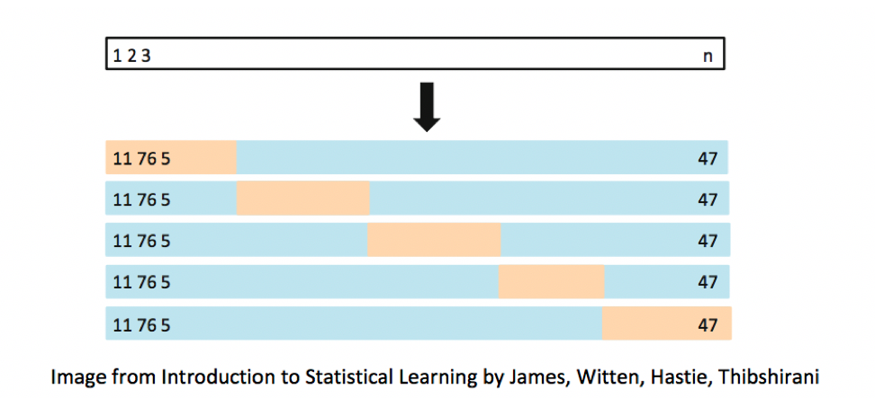

# Predictive Modeling

**Learning Outcomes:**     

1. Explain how prediction error changes, depending on model complexity, for both training data and test data.   
2. Explain the variance bias tradeoff, and identify situations when predictions might be impacted by either variance or bias.    
3. Describe how overfitting can impact prediction accuracy.    
4. Explain how and why we use cross-validation in predictive modeling.     
5. Compare and contrast Ridge regression and ordinary least squares regression.    
6. Explain the role of the parameter $\lambda$ is Ridge regression.   
7. Given possible sets of regression coefficients, determine which would be optimal, using either ordinary least squares, Ridge regression, or Lasso regression.     
8. Compare and contrast the assumptions made in decision trees, to those in the normal error regression model.    
9. Given possible splits for a node in a decision tree, determine which is optimal.   
10. Explain how the depth of a tree impacts prediction variance and bias, and overfitting.     
11. Describe how decision trees in a random forest differ from one another.   
12. Explain the process of fitting a polynomial spline to data, and the impact the the number of knots has on the process.   
13. Explain the assumptions made in predictive modeling, and identify situations where these assumptions might be inappropriate or problematic from an ethical standpoint.  


```{r, include=FALSE}
knitr::opts_chunk$set(echo = TRUE, message=FALSE, warning=FALSE, fig.height = 3, fig.width = 7, cache=TRUE)
library(ggformula)
library(moderndive)
library(gridExtra)
library(skimr)
library(Bolstad)
library(GGally)
library(Lock5Data)
library(knitr)
library(caret)
library(MASS)
library(tidyverse)
options(scipen=999)
set.seed(07302020)
```


## Training and Test Error


### Modeling for Prediction

* When our purpose is purely prediction, we don't need to worry about keeping the model simple enough to interpret.     
* Goal is to fit data well enough to make good predictions on new data without modeling random noise (overfitting)     
* A model that is too simple suffers from high bias    
* A model that is too complex suffers from high variance and is prone to overfitting    
* The right balance is different for every dataset    
* Measuring error on data used to fit the model (training data) does not accurately predict how well model will be able to predict new data (test data)

### Prediction Simulation Example

Suppose we have a set of 100 observations of a single explanatory variable $x$, and response variable $y$. A scatterplot of the data is shown below. 

```{r, echo=FALSE}
set.seed(02252019)
x <- runif(10000, 0, 10)
y <- 0.1*(x)*(x-5)*(x-9) + rnorm(10000,0, 3)
df <- data.frame(x,y)
```

```{r, echo=FALSE}
samp <- sample(1:nrow(df), 100) 
Sampdf <- df[samp, ]
df$samp <- rownames(df) %in% samp
df <- df %>% arrange(samp)
new <- sample(1:nrow(df), 100) 
Newdf <- df[new, ]
df$new <- rownames(df) %in% new
```

```{r, fig.height=5, fig.width=8, echo=FALSE}
ggplot(data=Sampdf, aes(y=y, x=x))+geom_point() 
```


**Constant Model to Sample Data**

```{r, fig.height=5, fig.width=8, echo=FALSE}
ggplot(data=Sampdf, aes(y=y, x=x))+geom_point() + geom_hline(yintercept = mean(Sampdf$y), color="blue")
```


**Linear Model to Sample Data**

```{r, fig.height=5, fig.width=8, echo=FALSE}
ggplot(data=Sampdf, aes(y=y, x=x))+geom_point() + stat_smooth(method="lm", se=FALSE, color="blue") 
```


**Quadratic Model**

```{r, fig.height=5, fig.width=8, echo=FALSE}
ggplot(data=Sampdf, aes(y=y, x=x)) + geom_point() + stat_smooth(method="lm", se=TRUE, fill=NA, formula=y ~ poly(x, 2, raw=TRUE),colour="blue")  
```


**Cubic Model**

```{r, fig.height=5, fig.width=8, echo=FALSE}
ggplot(data=Sampdf, aes(y=y, x=x)) + geom_point() + stat_smooth(method="lm", se=TRUE, fill=NA, formula=y ~ poly(x, 3, raw=TRUE),colour="blue")  
```


**Quartic Model**

```{r, fig.height=5, fig.width=8, echo=FALSE}
ggplot(data=Sampdf, aes(y=y, x=x)) + geom_point() + stat_smooth(method="lm", se=TRUE, fill=NA, formula=y ~ poly(x, 4, raw=TRUE),colour="red")   + stat_smooth(method="lm", se=TRUE, fill=NA, formula=y ~ poly(x, 3, raw=TRUE),colour="blue") 
```


**Degree 8 Model**

```{r, fig.height=5, fig.width=8, echo=FALSE}
ggplot(data=Sampdf, aes(y=y, x=x)) + geom_point() + stat_smooth(method="lm", se=TRUE, fill=NA, formula=y ~ poly(x, 8, raw=TRUE),colour="darkgreen")  +  stat_smooth(method="lm", se=TRUE, fill=NA, formula=y ~ poly(x, 3, raw=TRUE),colour="blue") + stat_smooth(method="lm", se=TRUE, fill=NA, formula=y ~ poly(x, 4, raw=TRUE),colour="red") 
```


### Model Complexity

* The complexity of the model increases as we add higher-order terms. This makes the model more flexible. The curve is allowed to have more twists and bends.     


* For higher-order, more complex models, individual points have more influence on the shape of the curve.   


```{r, echo=FALSE, fig.width=10}
p1 <- ggplot(data=Sampdf, aes(y=y, x=x))+geom_point() + geom_hline(yintercept = mean(Sampdf$y), color="blue") + ggtitle("Constant Model")
p2 <- ggplot(data=Sampdf, aes(y=y, x=x))+geom_point() + stat_smooth(method="lm", se=TRUE, fill=NA, formula=y ~ poly(x, 3, raw=TRUE),colour="blue")+ ggtitle("Cubic Model")
p3 <- ggplot(data=Sampdf, aes(y=y, x=x))+geom_point() + stat_smooth(method="lm", se=TRUE, fill=NA, formula=y ~ poly(x, 8, raw=TRUE),colour="blue") + ggtitle("Eighth Degree Model")
grid.arrange(p1, p2, p3, ncol=3) 
```


### New Data for Prediction

Now, suppose we have a new dataset of 100, x-values, and want to predict $y$. The first 5 rows of the new dataset are shown

```{r, echo=FALSE}
df$Prediction <- "?"
kable(df %>% filter(new==TRUE) %>% dplyr::select(x, Prediction) %>%  head(5))
```


### Fit Polynomial Models

```{r}
Sim_M0 <-lm(data=Sampdf, y~1)
Sim_M1 <-lm(data=Sampdf, y~x)
Sim_M2 <- lm(data=Sampdf, y~x+I(x^2))
Sim_M3 <- lm(data=Sampdf, y~x+I(x^2)+I(x^3))
Sim_M4 <- lm(data=Sampdf, y~x+I(x^2)+I(x^3)+I(x^4))
Sim_M5 <- lm(data=Sampdf, y~x+I(x^2)+I(x^3)+I(x^4)+I(x^5))
Sim_M6 <- lm(data=Sampdf, y~x+I(x^2)+I(x^3)+I(x^4)+I(x^5)+I(x^6))
Sim_M7 <- lm(data=Sampdf, y~x+I(x^2)+I(x^3)+I(x^4)+I(x^5)+I(x^6)+I(x^7))
Sim_M8 <- lm(data=Sampdf, y~x+I(x^2)+I(x^3)+I(x^4)+I(x^5)+I(x^6)+I(x^7)+I(x^8))
```

### Predictions for New Data

```{r}
Newdf$Deg0Pred <- predict(Sim_M0, newdata=Newdf)
Newdf$Deg1Pred <- predict(Sim_M1, newdata=Newdf)
Newdf$Deg2Pred <- predict(Sim_M2, newdata=Newdf)
Newdf$Deg3Pred <- predict(Sim_M3, newdata=Newdf)
Newdf$Deg4Pred <- predict(Sim_M4, newdata=Newdf)
Newdf$Deg5Pred <- predict(Sim_M5, newdata=Newdf)
Newdf$Deg6Pred <- predict(Sim_M6, newdata=Newdf)
Newdf$Deg7Pred <- predict(Sim_M7, newdata=Newdf)
Newdf$Deg8Pred <- predict(Sim_M8, newdata=Newdf)
```


### Predicted Values and True y

In fact, since these data were simulated, we know the true value of $y$, so we can compare the predicted values to the true ones.   

```{r}
kable(Newdf %>% dplyr::select(-c(samp)) %>% round(2) %>% head(5))
```


### Evaluating Predictions - RMSE

For quantitative response variables, we can evaluate the predictions by calculating the average of the squared differences between the true and predicted values. Often, we look at the square root of this quantity. This is called the Root Mean Square Prediction Error (RMSPE). 

\[
\text{RMSPE} = \sqrt{\displaystyle\sum_{i=1}^{n'}\frac{(y_i-\hat{y}_i)^2}{n'}},
\]

where $n'$ represents the number of new cases being predicted.    

### Calculate Prediction Error

```{r}
RMSPE0 <- sqrt(mean((Newdf$y-Newdf$Deg0Pred)^2))
RMSPE1 <- sqrt(mean((Newdf$y-Newdf$Deg1Pred)^2))
RMSPE2 <- sqrt(mean((Newdf$y-Newdf$Deg2Pred)^2))
RMSPE3 <- sqrt(mean((Newdf$y-Newdf$Deg3Pred)^2))
RMSPE4 <- sqrt(mean((Newdf$y-Newdf$Deg4Pred)^2))
RMSPE5 <- sqrt(mean((Newdf$y-Newdf$Deg5Pred)^2))
RMSPE6 <- sqrt(mean((Newdf$y-Newdf$Deg6Pred)^2))
RMSPE7 <- sqrt(mean((Newdf$y-Newdf$Deg7Pred)^2))
RMSPE8 <- sqrt(mean((Newdf$y-Newdf$Deg8Pred)^2))
```


### Prediction RMSPE by Model

```{r, echo=FALSE}
Degree <- 0:8
RMSPE <- c(RMSPE0, RMSPE1, RMSPE2, RMSPE3, RMSPE4, RMSPE5, RMSPE6, RMSPE7, RMSPE8)
kable(data.frame(Degree, RMSPE))
```


### Training and Test Data

* The new data on which we make predictions is called **test data**.    

* The data used to fit the model is called **training data**.   

* In the training data, we know the values of the explanatory and response variables. In the test data, we know only the values of the explanatory variables and want to predict the values of the response variable. 

* For quantitative response variables, if we find out the values of $y$, we can evaluate predictions, using RMSPE. This is referred to as **test error**.    

* We can also calculate root mean square error on the training data from the known y-values. This is called **training error**.  

### Training Data Error

```{r}
RMSE0 <- sqrt(mean(Sim_M0$residuals^2))
RMSE1 <- sqrt(mean(Sim_M1$residuals^2))
RMSE2 <- sqrt(mean(Sim_M2$residuals^2))
RMSE3 <- sqrt(mean(Sim_M3$residuals^2))
RMSE4 <- sqrt(mean(Sim_M4$residuals^2))
RMSE5 <- sqrt(mean(Sim_M5$residuals^2))
RMSE6 <- sqrt(mean(Sim_M6$residuals^2))
RMSE7 <- sqrt(mean(Sim_M7$residuals^2))
RMSE8 <- sqrt(mean(Sim_M8$residuals^2))
```

### Test and Training Error

```{r}
Degree <- 0:8
Test <- c(RMSPE0, RMSPE1, RMSPE2, RMSPE3, RMSPE4, RMSPE5, RMSPE6, RMSPE7, RMSPE8)
Train <- c(RMSE0, RMSE1, RMSE2, RMSE3, RMSE4, RMSE5, RMSE6, RMSE7, RMSE8)
RMSPEdf <- data.frame(Degree, Test, Train)
RMSPEdf
```


### Graph  of RMSPE

```{r, echo=FALSE}
RMSPEdf <- RMSPEdf %>% pivot_longer(c(Test, Train), names_to="Error_Type", values_to = "Error")
```

```{r, echo=FALSE}
ggplot(data=RMSPEdf, aes(x=Degree, y=Error, color=Error_Type)) +  geom_point() + ylim(c(2.7,4.5)) + geom_line()
```

* Training error decreases as model becomes more complex     
* Testing error is lowest for the 3rd degree model, then starts to increase again     

### Third Degree Model Summary

```{r}
summary(Sim_M3)
```


### True Data Model

In fact, the data were generated from the model $y_i = 4.5x  - 1.4x^2 +  0.1x^3 + \epsilon_i$, where $\epsilon_i\sim\mathcal{N}(0,3)$

```{r, fig.height=4.5, fig.width=8, echo=FALSE}
ggplot(data=df, aes(y=y, x=x, color=samp, size=samp))+geom_point()
```

### True Data Model

In fact, the data were generated from the model $y_i = 4.5x  - 1.4x^2 +  0.1x^3 + \epsilon_i$, where $\epsilon_i\sim\mathcal{N}(0,3)$

The yellow curve represents the true expected response curve.  


```{r, echo=FALSE}
equation0 <- function(x){4.5*x -1.4*x^2 +0.1*x^3}
equation1 <- function(x){coef(Sim_M1)[1] + coef(Sim_M1)[2]*x}
equation2 <- function(x){coef(Sim_M3)[1] + coef(Sim_M3)[2]*x+ coef(Sim_M3)[3]*x^2+ coef(Sim_M3)[4]*x^3}
equation3  <- function(x){coef(Sim_M8)[1] + coef(Sim_M8)[2]*x+ coef(Sim_M8)[3]*x^2+ coef(Sim_M8)[4]*x^3 + coef(Sim_M8)[5]*x^4 + coef(Sim_M8)[6]*x^5 + coef(Sim_M8)[7]*x^6 + coef(Sim_M8)[8]*x^7 + coef(Sim_M8)[9]*x^8}
```

```{r, fig.height=4.5, fig.width=8, echo=FALSE}
ggplot(data=df, aes(y=y, x=x, color=samp, size=samp))+geom_point()+ 
        stat_function(fun=equation0,geom="line",color="yellow", size=3)
```

### Linear Model on Larger Population

The yellow curve represents the true expected response curve.  

```{r, echo=FALSE, fig.height=4, fig.width=8}
PM3 <- ggplot(data=df, aes(y=y, x=x, color=samp, size=samp)) + geom_point() + 
        stat_function(fun=equation0,geom="line",color="yellow", size=3) +
        stat_function(fun=equation1,geom="line",color="blue", size=3)
PM3
```


### Cubic Model on Larger Population

The yellow curve represents the true expected response curve.  

```{r, echo=FALSE}
equation0 <- function(x){4.5*x -1.4*x^2 +0.1*x^3}
equation1 <- function(x){coef(Sim_M1)[1] + coef(Sim_M1)[2]*x}
equation2 <- function(x){coef(Sim_M3)[1] + coef(Sim_M3)[2]*x+ coef(Sim_M3)[3]*x^2+ coef(Sim_M3)[4]*x^3}
equation3  <- function(x){coef(Sim_M8)[1] + coef(Sim_M8)[2]*x+ coef(Sim_M8)[3]*x^2+ coef(Sim_M8)[4]*x^3 + coef(Sim_M8)[5]*x^4 + coef(Sim_M8)[6]*x^5 + coef(Sim_M8)[7]*x^6 + coef(Sim_M8)[8]*x^7 + coef(Sim_M8)[9]*x^8}
```

```{r, echo=FALSE, fig.height=4, fig.width=8}
PM3 <- ggplot(data=df, aes(y=y, x=x, color=samp, size=samp)) + geom_point() + 
        stat_function(fun=equation0,geom="line",color="yellow", size=3) +
        stat_function(fun=equation1,geom="line",color="blue", size=3) +
        stat_function(fun=equation2,geom="line",color="purple", size=3) 
PM3
```


### Eighth-Degree Model on Larger Population

The yellow curve represents the true expected response curve.  

```{r, echo=FALSE}
equation0 <- function(x){4.5*x -1.4*x^2 +0.1*x^3}
equation1 <- function(x){coef(Sim_M1)[1] + coef(Sim_M1)[2]*x}
equation2 <- function(x){coef(Sim_M3)[1] + coef(Sim_M3)[2]*x+ coef(Sim_M3)[3]*x^2+ coef(Sim_M3)[4]*x^3}
equation3  <- function(x){coef(Sim_M8)[1] + coef(Sim_M8)[2]*x+ coef(Sim_M8)[3]*x^2+ coef(Sim_M8)[4]*x^3 + coef(Sim_M8)[5]*x^4 + coef(Sim_M8)[6]*x^5 + coef(Sim_M8)[7]*x^6 + coef(Sim_M8)[8]*x^7 + coef(Sim_M8)[9]*x^8}
```

```{r, echo=FALSE, fig.height=4, fig.width=8}
PM3 <- ggplot(data=df, aes(y=y, x=x, color=samp, size=samp)) + geom_point() + 
        stat_function(fun=equation0,geom="line",color="yellow", size=3) +
        stat_function(fun=equation1,geom="line",color="blue", size=3) +
        stat_function(fun=equation2,geom="line",color="purple", size=3) +  
        stat_function(fun=equation3,geom="line",color="green", size=3)   
PM3
```

The 8th degree model performs worse than the cubic. The extra terms cause the model to be "too flexible," and it starts to model random fluctuations (noise) in the training data, that do not capture the true trend for the population. This is called **overfitting.**

### Model Complexity, Training Error, and Test Error

```{r, echo=FALSE, fig.height=4.5, fig.width=10}
x <- seq(from=1, to=4, by=0.01)
TestError <- (x-2)^2 +1
TrainingError <- 1/(x) + 0.25
plot(x, TrainingError, type="l", ylim=c(0,2), xlab="Model Complexity", ylab="Error", xaxt='n', yaxt='n', col="red")
lines(x=x, y=TestError, type="l", col="blue")
text("RMSE on Training Data", x=3.5, y=1, col="red")
text("RMSPE on Test Data", x=3.1, y=1.85, col="blue")
```

## Variance-Bias Tradeoff    

### What Contributes to Prediction Error?

Suppose $Y_i = f(x_i) + \epsilon_i$, where $\epsilon_i\sim\mathcal{N}(0,\sigma)$. 

Let $\hat{f}$ represent the function of our explanatory variable(s) $x^*$ used to predict the value of response variable $y^*$. Thus $\hat{y}^* = f(x^*)$. 


There are three factors that contribute to the expected value of $\left(y^* - \hat{y}\right)^2 = \left(y^* - \hat{f}(x^*)\right)^2$. 


1. **Bias associated with fitting model:** Model bias pertains to the difference between the true response function value $f(x^*)$, and the average value of $\hat{f}(x^*)$ that would be obtained in the long run over many samples.   
        - for example, if the true response function $f$ is cubic, then using a constant, linear, or quadratic model would result in biased predictions for most values of $x^*$.    
        
2. **Variance associated with  fitting model:** Individual observations in the  training data are subject to random sampling variability. The more flexible a model is, the more weight is put on each individual observation increasing the variance associated with the model.    

3. **Variability associated with prediction:** Even if we knew the true value $f(x^*)$, which represents the expected value of $y^*$ given $x=x^*$, the actual value of $y^*$ will vary  due to random noise (i.e. the $\epsilon_i\sim\mathcal{N}(0,\sigma)$ term). 


### Variance and Bias

The third source of variability cannot be controlled or eliminated. The first two, however are things we can control. If we could figure out how to minimize bias while also minimizing variance associated with a prediction, that would be great! But...


The constant model suffers from high bias. Since it does not include a linear, quadratic, or cubic term, it cannot accurately approximate the true regression function. 

The Eighth degree model suffers from high variance. Although it could, in theory, approximate the true regression function correctly, it is too flexible, and is thrown off because of the influence of individual points with high degrees of variability.  


```{r, echo=FALSE, fig.height=3, fig.width=10}
p1 <- ggplot(data=Sampdf, aes(y=y, x=x))+geom_point() + geom_hline(yintercept = mean(Sampdf$y), color="blue", size=2) + ggtitle("Constant Model") + 
        stat_function(fun=equation0,geom="line",color="yellow", size=2)
p2 <- ggplot(data=Sampdf, aes(y=y, x=x))+geom_point() + stat_smooth(method="lm", se=TRUE, fill=NA, formula=y ~ poly(x, 3, raw=TRUE),colour="blue", size=2)+ ggtitle("Cubic Model") + 
        stat_function(fun=equation0,geom="line",color="yellow", size=2)
p3 <- ggplot(data=Sampdf, aes(y=y, x=x))+geom_point() + stat_smooth(method="lm", se=TRUE, fill=NA, formula=y ~ poly(x, 8, raw=TRUE),colour="blue", size=2) + ggtitle("Eighth Degree Model") + 
        stat_function(fun=equation0,geom="line",color="yellow", size=2)
grid.arrange(p1, p2, p3, ncol=3) 
```


### Variance-Bias Tradeoff

As model complexity (flexibility) increases, bias decreases. Variance, however, increases.  


```{r, echo=FALSE, fig.height=3.5, fig.width=10}
x <- seq(from=1, to=3, by=0.01)
Var <- x^2/10
Bias <- 1/x
Error <- sqrt(Bias^2+Var) 
plot(x, Error, type="l", ylim=c(0,1), xlab="Model Complexity", ylab="", xaxt='n', yaxt='n')
lines(x=x, y=Var, type="l", col="blue")
lines(x=x, y=Bias^2, type="l", col="red")
text("RMSPE", x=2.3, y=0.95)
text("Variance", x=1.2, y=0.2, col="blue")
text("Bias^2", x=2.8, y=0.2, col="red")
```


In fact, it can be shown that:

$\text{Expected RMSPE} = \text{Variance} + \text{Bias}^2$

Our goal is the find the "sweetspot" where expected RMSPE is minimized.  


## Cross-Validation

### Cross-Validation (CV)

We've seen that training error is not an accurate approximation of test error. Instead, we'll approximate test error, by setting aside a set of the training data, and using it as if it were a test set. This process is called **cross-validation**, and the set we put aside is called the **validation set.**


1. Partition data into disjoint sets (folds). Approximately 5 folds recommended.     
2. Build a model using 4 of the 5 folds.  
3. Use model to predict responses for remaining fold.
4. Calculate root mean square error $RMSPE=\displaystyle\sqrt{\frac{\sum((\hat{y}_i-y_i)^2)}{n'}}$.    
5. Repeat for each of 5 folds.    
6. Average RMSPE values across folds. 

If computational resources permit, it is often beneficial to perform CV multiple times, using different sets of folds. 


### Cross-Validation Illustration

```{r echo=FALSE, out.width = '75%'}

```


```{r, echo=FALSE}
Order <- sample(1:nrow(Cars2015))
fold1 <- Order[1:22]
fold2 <- Order[23:44]
fold3 <- Order[45:66]
fold4 <- Order[67:88]
fold5 <- Order[89:110]
Fold <- data.frame(fold1, fold2, fold3, fold4, fold5)
```

### Models for Price of New Cars

Consider the following five models for predicting the price of a new car:

```{r}
M1 <- lm(data=Cars2015, LowPrice~Acc060)
M2 <- lm(data=Cars2015, LowPrice~Acc060 + I(Acc060^2))
M3 <- lm(data=Cars2015, LowPrice~Acc060 + I(Acc060^2) + Size)
M4 <- lm(data=Cars2015, LowPrice~Acc060 + I(Acc060^2) + Size + PageNum)
M5 <- lm(data=Cars2015, LowPrice~Acc060 * I(Acc060^2) * Size)
M6 <- lm(data=Cars2015, LowPrice~Acc060 * I(Acc060^2) * Size * PageNum)
```


```{r, echo=FALSE}
RMSPE <- array(NA, dim=c(5,6)) #5 folds, 5 models

for (i in 1:5){
M1 <- lm(data=Cars2015[-Fold[,i], ], LowPrice~Acc060)
M2 <- lm(data=Cars2015[-Fold[,i], ], LowPrice~Acc060 + I(Acc060^2))
M3 <- lm(data=Cars2015[-Fold[,i], ], LowPrice~Acc060 + I(Acc060^2) + Size)
M4 <- lm(data=Cars2015[-Fold[,i], ], LowPrice~Acc060 + I(Acc060^2) + Size + PageNum)
M5 <- lm(data=Cars2015[-Fold[,i], ], LowPrice~Acc060 * I(Acc060^2) * Size)
M6 <- lm(data=Cars2015[-Fold[,i], ], LowPrice~Acc060 * I(Acc060^2) * Size * PageNum)

Yhat1 <- predict(M1, newdata=Cars2015[Fold[,i], ])
Yhat2 <- predict(M2, newdata=Cars2015[Fold[,i], ])
Yhat3 <- predict(M3, newdata=Cars2015[Fold[,i], ])
Yhat4 <- predict(M4, newdata=Cars2015[Fold[,i], ])
Yhat5 <- predict(M5, newdata=Cars2015[Fold[,i], ])
Yhat6 <- predict(M6, newdata=Cars2015[Fold[,i], ])

Y <- Cars2015[Fold[,i], ]$LowPrice
RMSPE[i, 1] <- sqrt(mean((Y-Yhat1)^2))
RMSPE[i, 2] <- sqrt(mean((Y-Yhat2)^2))
RMSPE[i, 3] <- sqrt(mean((Y-Yhat3)^2))
RMSPE[i, 4] <- sqrt(mean((Y-Yhat4)^2))
RMSPE[i, 5] <- sqrt(mean((Y-Yhat5)^2))
RMSPE[i, 6] <- sqrt(mean((Y-Yhat6)^2))
}
```

### Cross Validation in Cars Dataset

To Use cross validation on the cars dataset, we'll fit each model to 4 folds (88 cars), while withholding the other 1 fold (22 cars). 

We then make predictions on the last fold, and see which model yields the lowest MSPE.  

```{r}
t(Fold)
```


### CV Results

Rows show RMSPE, columns show model.

```{r}
kable(RMSPE)
```

Mean RMSPE

```{r}
apply(RMSPE,2,mean)
```

### CV Conclusions

* Model 3 achieves the best performance using cross-validation.  

* This is the model that includes a quadratic function of acceleration time and size. 

* Including page number, or interactions harms the performance of the model.    

* We should use Model 3 if we want to make predictions on new data. 


## Ridge Regression

### Regression on Housing Dataset - Some Exp. Vars. 

```{r, echo=FALSE}
data("ames_raw")
ames_raw <- as.data.frame(ames_raw)
ames_raw <- ames_raw %>% mutate_if(is.character,as.factor)
Ames_Num <- select_if(ames_raw, is.numeric)
ames_raw <- ames_raw[complete.cases(Ames_Num),]
ames_raw <- ames_raw %>% mutate_if(is.character, addNA)
ames_raw <- ames_raw %>% mutate_if(is.factor, addNA)
ames_raw$PID <- as.numeric(ames_raw$PID)
ames_raw <- ames_raw %>% select( `Overall Qual`, `Year Built`, `Mas Vnr Area`, `Central Air`, `Gr Liv Area`, `Lot Frontage`, `1st Flr SF`, `Bedroom AbvGr`, `TotRms AbvGrd`, everything())
ames_raw <- ames_raw %>% select(-c(Utilities, `Bldg Type`, `Exterior 2nd`, `Bsmt Cond`, `BsmtFin Type 1`, `Low Qual Fin SF`, `Total Bsmt SF`, `BsmtFin Type 2`, `Bsmt Cond`, `Exterior 1st`, `House Style`))
```

```{r, echo=FALSE}
set.seed(10302021)
samp <- sample(1:nrow(ames_raw), 1000)
Train_Data <- ames_raw[samp,]
Test_Data <- ames_raw[samp,]
Test_Data$SalePrice <- NA
```

```{r}
M_OLS <- lm(data=Train_Data, SalePrice ~ .)
head(coef(M_OLS),10) %>% round(3)
```

### Complexity in Model Coefficients

* We've thought about complexity in terms of the number of terms we include in a model, as well as whether we include quadratic terms and higher order terms and interactions

* We can also think about model complexity in terms of the coefficients $b_1, \ldots, b_p$. 

* Larger values of $b_1, \ldots, b_p$ are associated with more complex models. Smaller values of $b_1, \ldots, b_p$ are associated with less complex models. When $b_j=0$, this mean variable $j$ is not used in the model.   

### Ridge Regression Penalty

* We've seen that in ordinary least-squares regression, $b_0, b_1, \ldots, b_p$ are chosen in a way that to minimizes

\[ \displaystyle\sum_{i=1}^n (y_i -\hat{y}_i)^2  = \displaystyle\sum_{i=1}^n (y_i -(b_0 + b_1x_{i1} + b_2{x_i2} + \ldots +b_px_{ip}))^2 \]

* When $p$ is large, and we want to be careful of overfitting, a common approach is to add a "penalty term" to this function, to incentivize choosing low values of $b_1, \ldots, b_p$.    

Specifically, we minimize:

$$
\begin{aligned}
& \displaystyle\sum_{i=1}^n (y_i -\hat{y}_i)^2  + \lambda\displaystyle\sum_{j=1}^pb_j^2\\ =  & \displaystyle\sum_{i=1}^n (y_i -(b_0 + b_1x_{i1} + b_2x_{i2} + \ldots + b_px_{ip}))^2 + \lambda\displaystyle\sum_{j=1}^pb_j^2
\end{aligned}
$$

where $\lambda$ is a pre-determined positive constant. 

* Larger values of $b_j$ typically help the model better fit the training data, thereby making the first term smaller, but also make the second term larger. 

* The idea is the find optimal values of $b_0, b_1, \ldots, b_p$ that are large enough to allow the model to fit the data well, thus keeping the first term (SSR) small, while also keeping the penalty term small as well.   

### Choosing $\lambda$

The value of $\lambda$ is predetermined by the user. The larger the value of $\lambda$, the more heavily large $b_j's$ are penalized. A value of $\lambda=0$ corresponds to ordinary least-squares.  

$$
\begin{aligned}
Q=& \displaystyle\sum_{i=1}^n (y_i -\hat{y}_i)^2  + \lambda\displaystyle\sum_{j=1}^pb_j^2\\ =  & \displaystyle\sum_{i=1}^n (y_i -(b_0 + b_1x_{i1} + b_2x_{i2} + \ldots + b_px_{ip}))^2 + \lambda\displaystyle\sum_{j=1}^pb_j^2
\end{aligned}
$$


### Optimal value of $\lambda$

* Small values of $\lambda$ lead to more complex models, with larger $|b_j|$'s.     
* As $\lambda$ increases, $|b_j|$'s shrink toward 0. The model becomes less complex, thus bias increases, but variance decreases.     
* We can use cross validation to determine the optimal value of $\lambda$

```{r, echo=FALSE, fig.height=4, fig.width=10}
x <- seq(from=1, to=3, by=0.01)
Var <- x^2/10
Bias <- 1/x
Error <- sqrt(Bias^2+Var) 
plot(x, Error, type="l", ylim=c(0,1), xlab="large lambda                                                                                    small lambda", ylab="", xaxt='n', yaxt='n')
lines(x=x, y=Var, type="l", col="blue")
lines(x=x, y=Bias^2, type="l", col="red")
text("RMSPE", x=2.3, y=0.95)
text("Variance", x=1.2, y=0.2, col="blue")
text("Bias^2", x=2.8, y=0.2, col="red")
```


### Standardizing

```{r}
Train_sc <- Train_Data %>% mutate_if(is.numeric, scale)
```

* It is important to standardize each explanatory variable (i.e. subtract the mean and divide by the standard deviation).   

* This ensures each variable has mean 0 and standard deviation 1. 

* Without standardizing the optimal choice of $b_j$'s would depend on scale, with variables with larger absolute measurements having more influence.   

* We'll standardize the response variable too. Though this is not strictly necessary, it doesn't hurt. We can always transform back if necessary. 

* Standardization is performed using the `scale` command in R. 

### Ridge Regression on Housing Dataset

```{r}
control = trainControl("repeatedcv", number = 10, repeats=10)
l_vals = 10^seq(-3, 3, length = 100)

set.seed(11162020)
Housing_ridge <- train(SalePrice ~ .,
                       data = Train_sc, method = "glmnet", trControl=control , 
                      tuneGrid=expand.grid(alpha=0, lambda=l_vals))
```

```{r}
Housing_ridge$bestTune$lambda
```

### Ridge Regression on Housing Dataset

```{r}
control = trainControl("repeatedcv", number = 10, repeats=10)
l_vals = 10^seq(-3, 3, length = 100)

set.seed(11162020)
Housing_ridge <- train(SalePrice ~ .,
                       data = Train_sc, method = "glmnet", trControl=control , 
                      tuneGrid=expand.grid(alpha=0, lambda=l_vals))
```

```{r}
Housing_ridge$bestTune$lambda
```

### Ridge Regression MSPE by $\lambda$

```{r, echo=FALSE}
lambda <- Housing_ridge$results$lambda
RMSPE <- Housing_ridge$results$RMSE
ggplot(data=data.frame(lambda, RMSPE), aes(x=lambda, y=RMSPE))+geom_line() + xlim(c(0,2)) + ylim(c(0.45, 0.5)) + ggtitle("Ridge Regression Cross Validation Results")
```

### Ridge Regression Coefficients for Optimal Model

```{r, echo=FALSE}
M_OLS_sc <- lm(data=Train_sc, SalePrice ~ .)
OLS_coef <- M_OLS_sc$coefficients
Ridge_coef <- coef(Housing_ridge$finalModel, Housing_ridge$bestTune$lambda)[,1]
df <- data.frame(OLS_coef[2:10], Ridge_coef[2:10])
names(df) <-c("OLS Coeff", "Ridge Coeff")
df
```


### OLS and Ridge Predictions   

```{r}
library(glmnet)
MAT <- model.matrix(SalePrice~., data=Train_sc)
ridge_mod <- glmnet(x=MAT, y=Train_sc$SalePrice, alpha = 0, lambda=Housing_ridge$bestTune$lambda )
```

```{r, echo=FALSE}
y <- Train_sc$SalePrice
Pred_OLS <- predict(M_OLS_sc)
Pred_Ridge <- predict(ridge_mod, newx=MAT)
OLS_Resid <- y - Pred_OLS
Ridge_Resid <- y - Pred_Ridge
Resdf <- data.frame(y, Pred_OLS, Pred_Ridge, OLS_Resid, Ridge_Resid)
names(Resdf) <- c("y", "OLS Pred", "Ridge Pred", "OLS Resid", "Ridge Resid")
kable(head(Resdf))
```

### Choosing $b_j$ in OLS

In OLS, we choose $b_0, b_1, \ldots, b_p$ are chosen in a way that minimizes

\[ \displaystyle\sum_{i=1}^n (y_i -\hat{y}_i)^2  = \displaystyle\sum_{i=1}^n (y_i -(b_0 + b_1x_{i1} + b_2x_{i2} + \ldots + b_px_{ip}))^2 \]


OLS: $\displaystyle\sum_{i=1}^n (y_i -\hat{y}_i)^2$

```{r}
sum((y-Pred_OLS)^2)
```

Ridge: $\displaystyle\sum_{i=1}^n (y_i -\hat{y}_i)^2$

```{r}
sum((y-Pred_Ridge)^2)
```

Not surprisingly the OLS model achieves smaller $\displaystyle\sum_{i=1}^n (y_i -\hat{y}_i)^2$. This has to be true, since the OLS coefficients are chosen to minimize this quantity.   


### Choosing $b_j$ in Ridge Regression 

In ridge regression, $b_0, b_1, \ldots, b_p$ are chosen in a way that minimizes

$$
\begin{aligned}
Q=& \displaystyle\sum_{i=1}^n (y_i -\hat{y}_i)^2  + \lambda\displaystyle\sum_{j=1}^pb_j^2\\ =  & \displaystyle\sum_{i=1}^n (y_i -(b_0 + b_1x_{i1} + b_2x_{i2} + \ldots + b_px_{ip}))^2 + \lambda\displaystyle\sum_{j=1}^pb_j^2
\end{aligned}
$$

OLS: $\displaystyle\sum_{i=1}^n (y_i -\hat{y}_i)^2  + \lambda\displaystyle\sum_{j=1}^pb_j^2$

```{r}
sum((y-Pred_OLS)^2) + 0.6136*sum(coef(M_OLS_sc)[-1]^2) 
```

Ridge: $\displaystyle\sum_{i=1}^n (y_i -\hat{y}_i)^2  + \lambda\displaystyle\sum_{j=1}^pb_j^2$

```{r}
sum((y-Pred_Ridge)^2) + 0.6136*sum((Ridge_coef)[-1]^2)
```

We see that the ridge coefficients achieve a lower value of Q than the OLS ones. 


### Lasso Regression

Lasso regression is very similar to ridge regression. Coefficients $b_0, b_1, \ldots, b_p$ are chosen in a way that to minimizes

$$
\begin{aligned}
& \displaystyle\sum_{i=1}^n (y_i -\hat{y}_i)^2  + \lambda\displaystyle\sum_{j=1}^p|b_j|\\ =  & \displaystyle\sum_{i=1}^n (y_i -(b_0 + b_1x_{i1} + b_2x_{i2} + \ldots + b_px_{ip}))^2 + \lambda\displaystyle\sum_{j=1}^p|b_j|
\end{aligned}
$$


## Decision Trees

### Basics of Decision Trees

* A decision tree is a flexible alternative to a regression model. It is said to be **nonparametric** because it does not involve parameters like $\beta_0, \beta_1, \ldots \beta_p$.     

* A tree makes no assumption about the nature of the relationship between the response and explanatory variables, and instead allows us to learn this relationship from the data.     


* A tree makes prediction by repeatedly grouping together like observations in the training data.    

* We can make predictions for a new case, by tracing it through the tree, and averaging responses of training cases in the same terminal node.  

### Decision Tree Example

```{r, echo=FALSE, fig.height=4.5, fig.width=11}
library(rpart)
library(rpart.plot)
tree <- rpart(SalePrice~., data=Train_Data, cp=0.04)
rpart.plot(tree, box.palette="RdBu", shadow.col="gray", nn=TRUE, cex=1, extra=1)
```

* The predicted price of a House with overall quality 7, and was built in 1995 is $200,000.    

* The predicted price of a House overall quality 8 and 1,750 sq. ft. on the first floor is $370,000. 

### Partitioning in A Decision Tree

* For a quantitative response variable, data are split into two nodes so that responses in the same node are as similar as possible, while responses in the  different nodes are as different as possible.    

* Let L and R represent the left and right nodes from a possible split. Let $n_L$ and $n_R$ represent the number of observations in each node, and $\bar{y}_L$ and $\bar{y}_R$ represent the mean of the training data responses in each node.   

* For each possible split, involving an explanatory variable, we calculate: 


\[ \displaystyle\sum_{i=1}^{n_L} (y_i -\bar{y}_L)^2 + \displaystyle\sum_{i=1}^{n_R} (y_i -\bar{y}_R)^2
\]


* We choose the split that minimizes this quantity.

### Partitioning Example       

```{r, echo=FALSE, cache=FALSE}
set.seed(11142020)
#x1 <- rdunif(15, 0, 10)
#x2 <- rdunif(15, 0, 10)
#y <- round(4*x1^2 + 10*x2^1.5*(x1 < 7.5) + rnorm(15,0,5),0)
x1 <- c(8,2,8,1,8,6,2,5,1,8,4,10,9,8,6)
x2 <- c(5,3,1,1,4,3,8,1,10,8,6,5,0,2,1)
y <- c(253, 64, 258, 21, 257, 203, 246, 114, 331, 256, 213, 406, 326, 273, 155)
Exdf <- data.frame(x1, x2, y)
t(Exdf)
```

```{r, echo=FALSE, cache=FALSE}
ggplot(data=Exdf, aes(x=x1, y=x2)) + geom_point() + geom_text(aes(label=y),hjust=0, vjust=2)
```


### One Possible Split ($x_1 < 5.5$)

We could split the data into 2 groups depending on whether $x_1 < 5.5$.    

```{r, fig.height=4.5, fig.width=8, echo=FALSE}
ggplot(data=Exdf, aes(x=x1, y=x2)) + geom_point() + geom_text(aes(label=y),hjust=0, vjust=2) + geom_vline(xintercept = 5.5, color="red", size=4)
```

### One Possible Split ($x_1 < 5.5$) (cont.)


* $\bar{y}_L = (331+246+213+21+64+114)/6 \approx 164.84$    
* $\bar{y}_R = (203+155+256+253+257+273+258+326+406)/9 \approx 265.22$


$$
\begin{aligned}
& \displaystyle\sum_{i=1}^{n_L} (y_i -\bar{y}_L)^2  \\
& =(331-164.83)^2+(246-164.33)^2 + \ldots+(114-164.33)^2 \\
& =69958.83
\end{aligned}
$$

$$
\begin{aligned}
\displaystyle\sum_{i=1}^{n_R} (y_i -\bar{y}_R)^2 \\
& =(203-265.22)^2+(155-265.22)^2 + \ldots+(406-265.22)^2 \\
& =39947.56
\end{aligned}
$$

* 69958.83 + 39947.56 = 109906.4


### Second Possible Split ($x_1 < 6.5$)

We could split the data into 2 groups depending on whether $x_1 < 6.5$.    

```{r, fig.height=4.5, fig.width=8, echo=FALSE}
ggplot(data=Exdf, aes(x=x1, y=x2)) + geom_point() + geom_text(aes(label=y),hjust=0, vjust=2) + geom_vline(xintercept = 6.5, color="red", size=2)
```


### Second Possible Split ($x_1 < 6.5$) (cont.)

* $\bar{y}_L = (331+246+213+21+64+114 + 203+155)/8 \approx 168.375$    
* $\bar{y}_R = (256+253+257+273+258+326+406)/7 \approx 289.857$


$$
\begin{aligned}
& \displaystyle\sum_{i=1}^{n_L} (y_i -\bar{y}_L)^2  \\
& =(331-168.375)^2+(246-168.375)^2 + \ldots+(203-168.375)^2 \\
& =71411.88
\end{aligned}
$$

$$
\begin{aligned}
\displaystyle\sum_{i=1}^{n_R} (y_i -\bar{y}_R)^2 \\
& =(203-289.857)^2+(155-289.857)^2 + \ldots+(406-289.857)^2 \\
& =19678.86
\end{aligned}
$$

* 71411.88 + 19678.86 = 91090.74

The split at $x1 < 6.5$ is better than $x_1<5.5$

### Third Possible Split ($x_2 < 5.5$)

We could split the data into 2 groups depending on whether $x_2 < 5.5$.    

```{r, fig.height=4.5, fig.width=8, echo=FALSE}
ggplot(data=Exdf, aes(x=x1, y=x2)) + geom_point()  + geom_hline(yintercept = 5.5, color="red", size=2) + geom_text(aes(label=y),hjust=0, vjust=2)
```

### Third Possible Split ($x_2 < 5.5$) (cont.)

* $\bar{y}_L = (331+246+213+256)/4 \approx 261.5$    
* $\bar{y}_R = (21 + 64 + \ldots + 406)/11 \approx 211.82$


$$
\begin{aligned}
& \displaystyle\sum_{i=1}^{n_L} (y_i -\bar{y}_L)^2  \\
& =(331-261.5)^2+(246-261.5)^2 + (213-261.5)^2+(256-261.5)^2 \\
& =7453
\end{aligned}
$$

$$
\begin{aligned}
\displaystyle\sum_{i=1}^{n_R} (y_i -\bar{y}_R)^2 \\
& =(21-211.82)^2+(64-211.82)^2 + \ldots+(406-211.82)^2 \\
& =131493.6
\end{aligned}
$$

* 7453 + 131493.6 = 138946.6

### Comparison of Splits

* Of the three split's we've calculated, $\displaystyle\sum_{i=1}^{n_L} (y_i -\bar{y}_L)^2 + \displaystyle\sum_{i=1}^{n_R} (y_i -\bar{y}_R)^2$ is minimized using $x_1 < 6.5$.   

* In fact, if we calculate all possible splits over $x_1$ and $x_2$, $\displaystyle\sum_{i=1}^{n_L} (y_i -\bar{y}_L)^2 + \displaystyle\sum_{i=1}^{n_R} (y_i -\bar{y}_R)^2$ is minimized by splitting on $x_1 < 6.5$    

### First Split

```{r, fig.height=4.5, fig.width=8, echo=FALSE}
ggplot(data=Exdf, aes(x=x1, y=x2)) + geom_point()  + geom_vline(xintercept = 6.5, color="red", size=2) + geom_text(aes(label=y),hjust=0, vjust=2)
```

### First Split in the Tree

```{r, echo=FALSE, fig.height=4.5, fig.width=11}
library(rpart)
library(rpart.plot)
tree <- rpart(y~., data=Exdf, cp=0.01, minsplit=15)
rpart.plot(tree, box.palette="RdBu", shadow.col="gray", nn=TRUE, cex=1, extra=1)
```

### Next Splits

* Next, we find the  best splits on the resulting two nodes. It turns out that the left node is best split on $x_2 < 4.5$, and the right node is best split on $x_1 < 8.5$.  


```{r, fig.height=4.5, fig.width=8, echo=FALSE}
ggplot(data=Exdf, aes(x=x1, y=x2)) + geom_point()  + geom_vline(xintercept = 6.5, color="red", size=2) + geom_vline(xintercept = 8.5, color="blue", size=2) + geom_segment(x = 0, y=4.5, xend=6.5, yend=4.5, color="blue", size=2) + geom_text(aes(label=y),hjust=0, vjust=2)
```

### Next Splits in Tree

```{r, echo=FALSE, fig.height=4.5, fig.width=11}
library(rpart)
library(rpart.plot)
tree <- rpart(y~., data=Exdf, cp=0.01, minsplit=6)
rpart.plot(tree, box.palette="RdBu", shadow.col="gray", nn=TRUE, cex=1, extra=1)
```

### Recursive Partitioning

* Splitting continues until nodes reach a certain predetermined minimal size, or until change improvement in model fit drops below a predetermined value

### Tree on Housing Data

```{r, echo=FALSE, fig.height=15, fig.width=11}
library(rpart)
library(rpart.plot)
tree <- rpart(SalePrice~., data=Train_Data, cp=0.001)
rpart.plot(tree, box.palette="RdBu", shadow.col="gray", nn=TRUE, cex=1, extra=1)
```


### Model Complexity in Trees

* The more we partition data into smaller nodes, the more complex the model becomes.    

* As we continue to partition, bias decreases, as cases are grouped with those that are more similar to themselves. On the other hand, variance increases, as there are fewer cases in each node to be averaged, putting more weight on each individual observation.

* Splitting into too small of nodes can lead to drastic overfitting. In the  extreme case, if we split all the way to nodes of size 1, we would get RMSE of 0 on the training data, but should certainly not expect RMSPE of 0 on the test data. 

* The optimal depth of the tree, or minimal size for terminal nodes can be determined using cross-validation.    

* the `rpart` package uses a complexity parameter `cp`, which determines how much a split must improve model fit in order to be made. Smaller values of `cp` are associated with more complex tree models.   


### Cross-Validation on Housing Data

```{r}
cp_vals = 10^seq(-8, 1, length = 100)
#cp_vals = c(0.00000001, 0.00001)
colnames(Train_sc) <- make.names(colnames(Train_sc))
#colnames(Train_Data) <- make.names(colnames(Train_Data))

set.seed(11162020)
Housing_Tree <- train(data=Train_sc, SalePrice ~ .,  method="rpart", trControl=control, 
                     tuneGrid=expand.grid(cp=cp_vals))
Housing_Tree$bestTune
```

```{r, echo=FALSE}
cp <- Housing_Tree$results$cp
RMSPE <- Housing_Tree$results$RMSE
ggplot(data=data.frame(cp, RMSPE), aes(x=cp, y=RMSPE))+geom_line() + xlim(c(0,0.001)) + ylim(c(0.475,0.485))  + 
  ggtitle("Regression Tree Cross Validation Results")
```


### Comparing OLS, Lasso, Ridge, and Tree

```{r, echo=FALSE}
set.seed(11162020)
Housing_OLS <- train(data=Train_sc, SalePrice ~ .,  method="lm", trControl=control)
set.seed(11162020)
Housing_lasso <- train(SalePrice ~., data = Train_sc, method = "glmnet", trControl=control, 
                      tuneGrid=expand.grid(alpha=1, lambda=l_vals))
```


```{r}
min(Housing_OLS $results$RMSE)
min(Housing_ridge$results$RMSE)
min(Housing_lasso$results$RMSE)
min(Housing_Tree$results$RMSE)
```

In this situation, the tree outperforms OLS, but does not do as well as lasso or ridge. The best model will vary depending on the nature of the data. We can use cross-validation to determine which model is likely to perform best in prediction.    


### Random Forest

* A popular extension of a decision tree is a random forest.   

* A random forest consists of many (often ~10,000) trees. Predictions are made by averaging predictions from individual trees.    

* In order to ensure the trees are different from each other:
    1. each tree is grown from a different bootstrap sample of the training data.    
    2. when deciding on a split, only a random subset of explanatory variables are considered.    
    
* Growing deep trees ensures low bias. In a random forest, averaging across many deep trees decreases variance, while maintaining low bias.   


## Regression Splines

### Regression Splines

* We've seen that we can use polynomial regression to capture nonlinear trends in data.    

* A **regression spline** is a piecewise function of polynomials.     

* Here we'll keep thing simple by focusing on a spline with a single explanatory variable. Splines can also be used for multivariate data.   


### Price of 2015 New Cars

```{r, echo=FALSE}
library(splines)
library(Lock5Data)
data(Cars2015)
Cars <- Cars2015
names(Cars)[names(Cars)=="LowPrice"] <- "Price"
#set.seed(07182019)
#samp <- sample(1:nrow(Cars))
#train <- Cars[samp[1:80],]
#test <- Cars[samp[81:110],]
set.seed(07182019)
samp <- sample(1:nrow(Cars))
train <- Cars[samp[1:75],]
test <- Cars[samp[76:110],]  
lims=range(Cars2015$Acc060)
grid=seq(from=lims[1],to=lims[2], by=0.01)
```

```{r, echo=FALSE}
plot(x=train$Acc060, y=train$Price, xlab="0-60 mph Acceleration Time in Sec.", ylab="Price in Thousands of Dollars", pch=16) 
text("Porsche 911", x=4.5, y=80, col="lightblue")
#text("Chevy Corvette", x=4.7, y=50, col="lightblue")
text("Chevy Camaro", x=5.2, y=20, col="lightblue")
```


### Two Models with High Bias

```{r, fig.width=11, echo=FALSE}
par(mfrow=c(1,2))
plot(x=train$Acc060, y=train$Price, xlab="0-60 mph Acceleration Time in Sec.", ylab="Price in Thousands of Dollars", main="Constant Model", pch=16) 
abline(h=mean(train$Price), col="red")
plot(x=train$Acc060, y=train$Price, xlab="0-60 mph Acceleration Time in Sec.", ylab="Price in Thousands of Dollars", main="Linear Model", pch=16) 
abline(lm(Price~Acc060, data=train), col="red")
```


### Cubic Model

```{r, echo=FALSE, fig.height=4.5, fig.width=7}
par(mfrow=c(1,1))
cubicfit=lm(Price~poly(Acc060,4),data=train)
cubicpred <- predict(cubicfit,newdata=list(Acc060=grid))
plot(train$Acc060,train$Price,col="black", xlab="0-60 mph Acceleration Time in Sec.", ylab="Price in Thousands of Dollars", pch=16)
lines(grid,cubicpred,lwd=2, col="red")
```


### Cubic Splines

```{r, echo=FALSE, fig.height=4.5, fig.width=7}
df <- 3
splinefit2 <- lm(Price~ns(Acc060,df=df),data=train)
spline2pred <- predict(splinefit2,newdata=list(Acc060=grid))
plot(train$Acc060,train$Price,col="black", xlab="0-60 mph Acceleration Time in Sec.", ylab="Price in Thousands of Dollars", , pch=16)
#lines(grid,cubicpred,lwd=2, col="red")
knots <- attr(ns(train$Acc060,df=3),"knots")
abline(v=knots[1])
abline(v=knots[2])
```


### Cubic Splines

```{r, echo=FALSE, fig.height=4.5, fig.width=7}
df <- 3
splinefit2 <- lm(Price~ns(Acc060,df=df),data=train)
spline2pred <- predict(splinefit2,newdata=list(Acc060=grid))
plot(train$Acc060,train$Price,col="black", xlab="0-60 mph Acceleration Time in Sec.", ylab="Price in Thousands of Dollars", pch=16)
#lines(grid,cubicpred,lwd=2, col="red")
knots <- attr(ns(train$Acc060,df=3),"knots")
lines(grid[grid<knots[1]],spline2pred[grid<knots[1]],lwd=2, col="lightblue")
lines(grid[grid>=knots[1] & grid < knots[2]],spline2pred[grid>=knots[1] & grid < knots[2]],lwd=2, col="red")
lines(grid[grid>=knots[2]],spline2pred[grid>=knots[2]],lwd=2, col="green")
points(knots[1], predict(splinefit2,newdata=list(Acc060=knots[1])), pch=0)
points(knots[2], predict(splinefit2,newdata=list(Acc060=knots[2])), pch=0)
abline(v=knots[1])
abline(v=knots[2])
```

*  region boundaries are called **knots**    


### Cubic Spline with 5 Knots

```{r, echo=FALSE, fig.height=4.5, fig.width=7}
df <- 6
splinefit5 <- lm(Price~ns(Acc060,df=df),data=train)
spline5pred <- predict(splinefit5,newdata=list(Acc060=grid))
plot(train$Acc060,train$Price,col="black", xlab="0-60 mph Acceleration Time in Sec.", ylab="Price in Thousands of Dollars", pch=16)
#lines(grid,spline5pred,lwd=2, col="red")
knots <- attr(ns(train$Acc060,df=6),"knots")
lines(grid[grid < knots[1]], spline5pred[grid < knots[1]],lwd=2, col="lightblue")
lines(grid[grid>=knots[1] & grid <= knots[2]],spline5pred[grid>=knots[1] & grid < knots[2]],lwd=2, col="red")
lines(grid[grid>=knots[2] & grid < knots[3]],spline5pred[grid>=knots[2] & grid < knots[3]],lwd=2, col="lightblue")
lines(grid[grid>=knots[3] & grid < knots[4]],spline5pred[grid>=knots[3] & grid < knots[4]],lwd=2, col="orange")
lines(grid[grid>=knots[4] & grid < knots[5]],spline5pred[grid>=knots[4] & grid < knots[5]],lwd=2, col="purple")
lines(grid[grid>=knots[5]],spline5pred[grid>=knots[5]],lwd=2, col="green")
points(knots[1], predict(splinefit5,newdata=list(Acc060=knots[1])), pch=0)
points(knots[2], predict(splinefit5,newdata=list(Acc060=knots[2])), pch=0)
points(knots[3], predict(splinefit5,newdata=list(Acc060=knots[3])), pch=0)
points(knots[4], predict(splinefit5,newdata=list(Acc060=knots[4])), pch=0)
points(knots[5], predict(splinefit5,newdata=list(Acc060=knots[5])), pch=0)
```


### Cubic Spline with 10 Knots

```{r, echo=FALSE, fig.height=4.5, fig.width=7}
df <- 11
splinefit11 <- lm(Price~ns(Acc060,df=df),data=train)
spline11pred <- predict(splinefit11,newdata=list(Acc060=grid))
plot(train$Acc060,train$Price,col="black", xlab="0-60 mph Acceleration Time in Sec.", ylab="Price in Thousands of Dollars", pch=16)
lines(grid,spline11pred,lwd=2, col="lightblue")
knots <- attr(ns(train$Acc060,df=11),"knots")
points(knots[1], predict(splinefit11,newdata=list(Acc060=knots[1])), pch=0)
points(knots[2], predict(splinefit11,newdata=list(Acc060=knots[2])), pch=0)
points(knots[3], predict(splinefit11,newdata=list(Acc060=knots[3])), pch=0)
points(knots[4], predict(splinefit11,newdata=list(Acc060=knots[4])), pch=0)
points(knots[5], predict(splinefit11,newdata=list(Acc060=knots[5])), pch=0)
points(knots[6], predict(splinefit11,newdata=list(Acc060=knots[6])), pch=0)
points(knots[7], predict(splinefit11,newdata=list(Acc060=knots[7])), pch=0)
points(knots[8], predict(splinefit11,newdata=list(Acc060=knots[8])), pch=0)
points(knots[9], predict(splinefit11,newdata=list(Acc060=knots[9])), pch=0)
points(knots[10], predict(splinefit11,newdata=list(Acc060=knots[10])), pch=0)
```


### Cubic Spline with 20 Knots

```{r, echo=FALSE, fig.height=4.5, fig.width=7}
df <- 21
splinefit21 <- lm(Price~ns(Acc060,df=df),data=train)
spline21pred <- predict(splinefit21,newdata=list(Acc060=grid))
plot(train$Acc060,train$Price,col="black", xlab="0-60 mph Acceleration Time in Sec.", ylab="Price in Thousands of Dollars", pch=16)
lines(grid,spline21pred,lwd=2, col="lightblue")
knots <- attr(ns(train$Acc060,df=21),"knots")
points(knots[1], predict(splinefit21,newdata=list(Acc060=knots[1])), pch=0)
points(knots[2], predict(splinefit21,newdata=list(Acc060=knots[2])), pch=0)
points(knots[3], predict(splinefit21,newdata=list(Acc060=knots[3])), pch=0)
points(knots[4], predict(splinefit21,newdata=list(Acc060=knots[4])), pch=0)
points(knots[5], predict(splinefit21,newdata=list(Acc060=knots[5])), pch=0)
points(knots[6], predict(splinefit21,newdata=list(Acc060=knots[6])), pch=0)
points(knots[7], predict(splinefit21,newdata=list(Acc060=knots[7])), pch=0)
points(knots[8], predict(splinefit21,newdata=list(Acc060=knots[8])), pch=0)
points(knots[9], predict(splinefit21,newdata=list(Acc060=knots[9])), pch=0)
points(knots[10], predict(splinefit21,newdata=list(Acc060=knots[10])), pch=0)
points(knots[11], predict(splinefit21,newdata=list(Acc060=knots[11])), pch=0)
points(knots[12], predict(splinefit21,newdata=list(Acc060=knots[12])), pch=0)
points(knots[13], predict(splinefit21,newdata=list(Acc060=knots[13])), pch=0)
points(knots[14], predict(splinefit21,newdata=list(Acc060=knots[14])), pch=0)
points(knots[15], predict(splinefit21,newdata=list(Acc060=knots[15])), pch=0)
points(knots[16], predict(splinefit21,newdata=list(Acc060=knots[16])), pch=0)
points(knots[17], predict(splinefit21,newdata=list(Acc060=knots[17])), pch=0)
points(knots[18], predict(splinefit21,newdata=list(Acc060=knots[18])), pch=0)
points(knots[19], predict(splinefit21,newdata=list(Acc060=knots[19])), pch=0)
points(knots[20], predict(splinefit21,newdata=list(Acc060=knots[20])), pch=0)
```


### Model Evaluation

* predicted price for 35 new 2015 cars not in original dataset     
* calculated mean square prediction error (MSPE)

```{r, echo=FALSE, fig.height=4.5, fig.width=7}
par(mar = c(8, 8, 2, 2))
RMSPE <- rep(NA, 20)
for (df in 1:20){
fit <- lm(Price~ns(Acc060,df=df),data=train)
testpred <- predict(fit, newdata = test)
RMSPE[df] <- mean((testpred-test$Price)^2)
}
plot(x=0:19, y=RMSPE, type="l", xlab="Number of Knots")
```


### Implementation of Splines

Important Considerations:

* how many knots   
* where to place knots      
* degree of polynomial

The best choices for all of these will vary between datasets and can be assessed through cross-validation.   


## Ethical Considerations    

### Assumptions in Predictive Models

1. Be sure we're predicting the right thing   
2. Training/Test data representative of population    
3. Prediction accuracy is appropriate metric    

### Amazon Hiring Algorithm    

### Recividism    

### Facial Recognition     


### Modeling for Prediction   

* Goal is to make the most accurate predictions possible.      
* Not concerned with understanding relationships between variables. Not worried model being to complicated to interpret, as long as it yields good predictions.       
* Aim for a model that best captures the signal in the data, without being thrown off by noise.    
      - Large number of predictors is ok      
      - Don't make model so complicated that it overfits the data.    
* Be sure that model is predicting what you intend it to      
* Reflective of biases inherent in the data on which it was trained     


